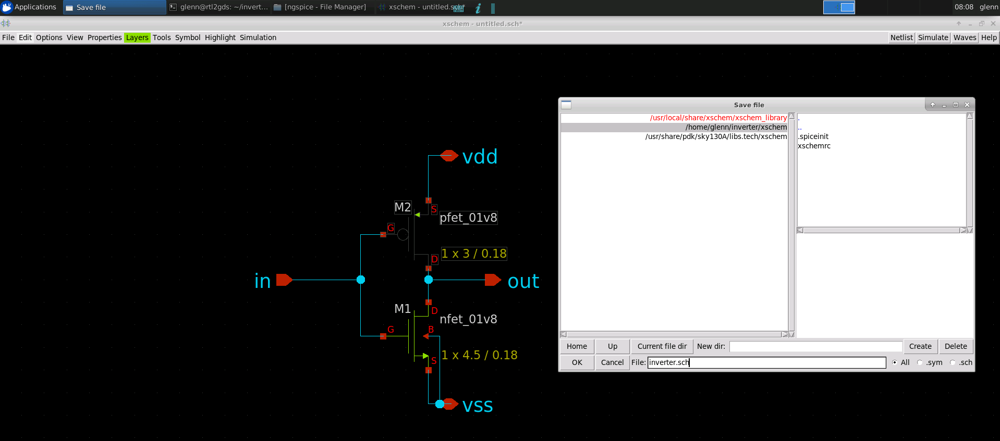
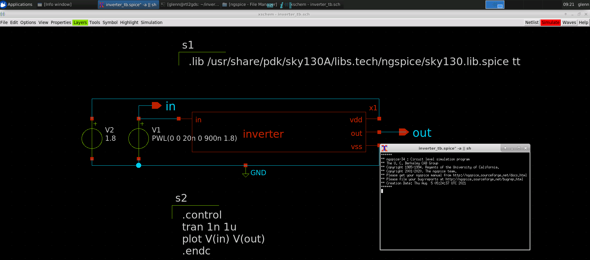
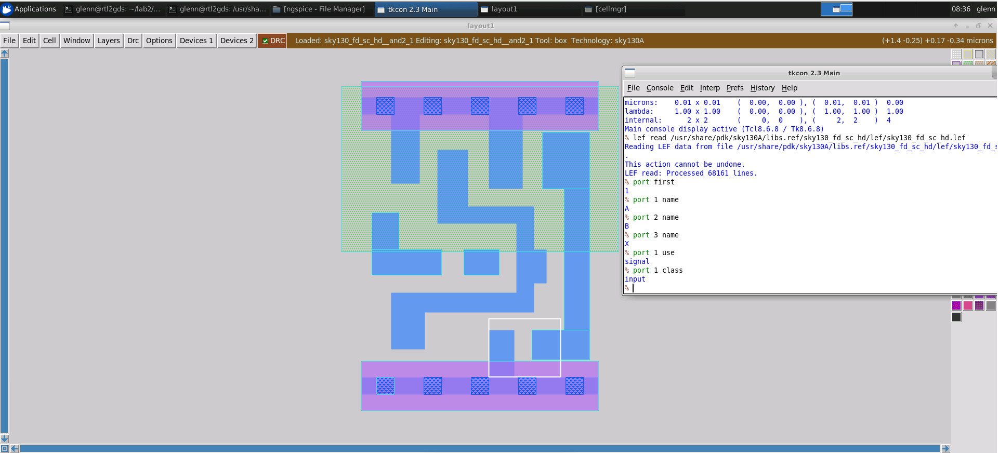
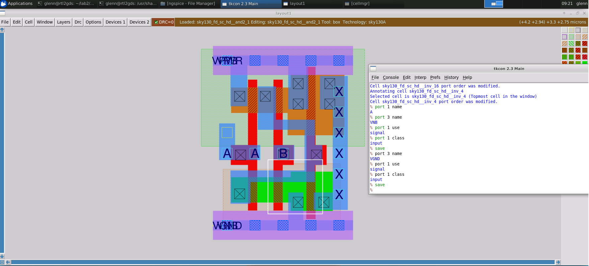
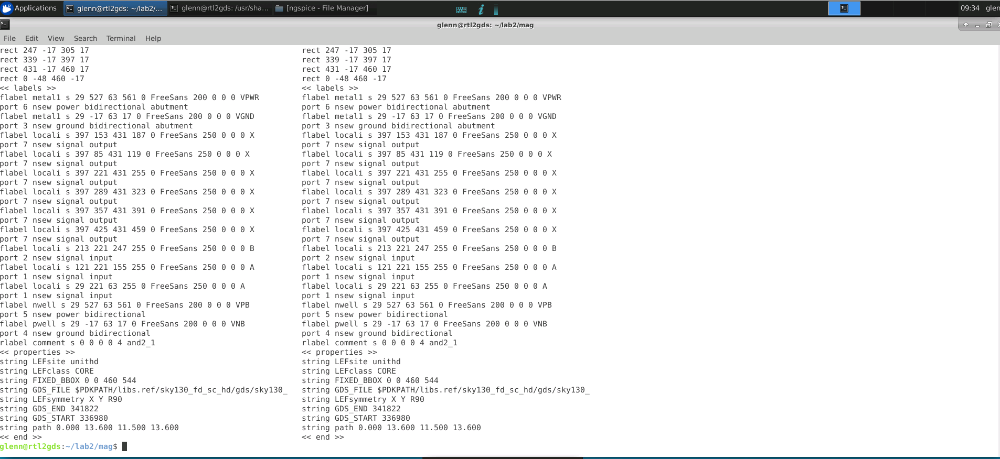
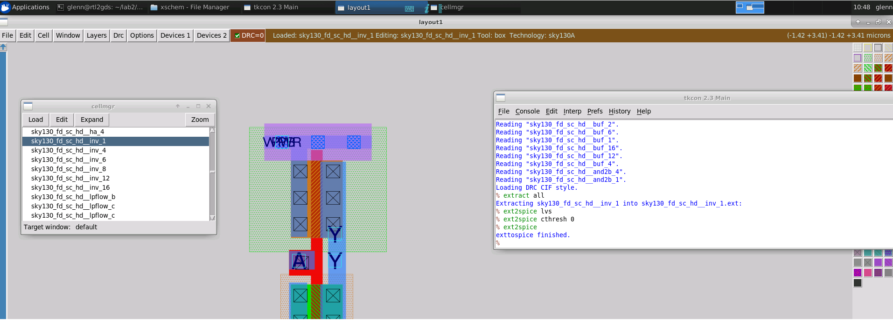
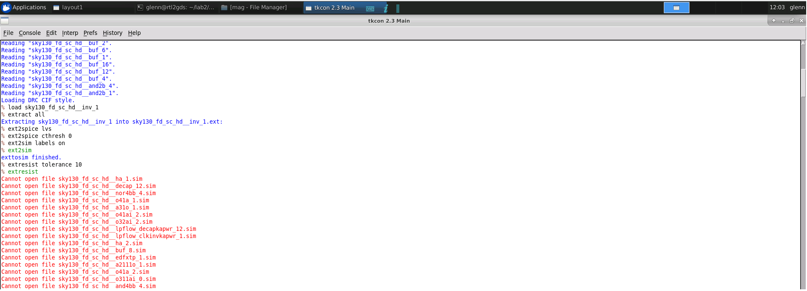
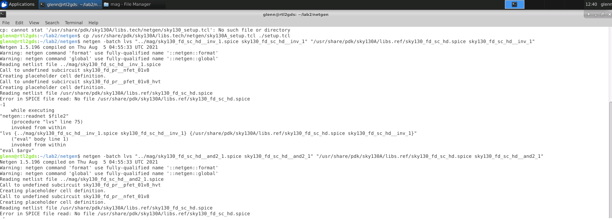
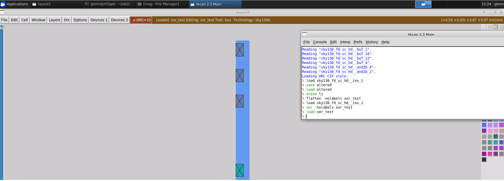
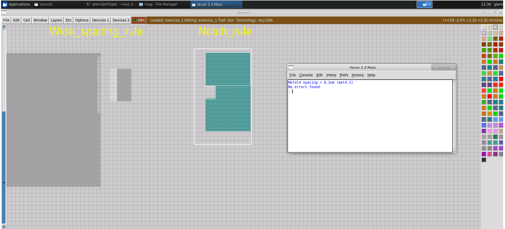

# Physical Verification using Sky130

### ABOUT THE WORKSHOP
The Workshop is a 5-day basic to advance program that is design for fresher who wants to build a career in VLSI industry. It is a cloud based workshop that comprises of training courses that covers RTL to GDS topics, labs, intelligent assessment program, and documentation to be presented in github which may serve as a resume.
### AUTHOR OF THE WORKSHOP
#### Mr. Kunal Ghosh
Co-founder of VLSI System Design (VSD) Corporation Private Limited
### AGENDA
  - ##### Day 1 - Introduction to SkyWater SKY130
    - Introduction to SkyWater PDKs and opensource EDA tools
      - Introduction to Skywater PDK
      - Opensource EDA Tools
      - Understanding Skywater PDK - Layers
      - Understanding Skywater PDK - Devices
      - Understanding Skywater PDK Libraries
      - Opensource Tools And Flows
    - Tool installations and basic DRC/LVS design flow
      - Check Tool Installations
      - Creating Sky130 Device Layout In Magic
      - Creating Simple Schematic In Xschem
      - Creating Symbol And Exporting Schematic In Xschem
      - Importing Schematic To Layout And Inverter Layout Steps
      - Final DRC/LVS Checks And Post Layout Simulations
 - ##### Day 2 - Design Rule Checks and Layout Vs. Simulation
      - Fundamentals of Physical Verification
      - Data Formats and GDSII
      - Extraction Styles and Options in Magic
      - GDS Reading and Writing in Magic
      - DRC Rules in Magic
      - LVS Setup for Netgen
      - XOR Verification
      - Lab - GDS read and Input Styles
      - Lab - Ports and Port Indexes
      - Lab - Abstract Views
      - Lab - Basic Extraction
      - lab - Setup for DRC
      - Lab - Setup for LVS
      - Lab - Setup for XOR
 - ##### Day 3 - Design Rule Checking
      - Fundamentals of Design Rule Checking
      - Back-end Metal Layer Rules
      - Local Interconnect Rules
      - Front-end Rules
      - Wells, Taps and Net Rules
      - Deeps N-Well and High Voltage Rules
      - Device Rules
      - Miscellaneous Rules and Latch-up, Antenna and Stress Rules
      - Density Rules
      - Recommended, Manufacturing and ERC Rules
      - Lab - Width and Spacing Rules
      - Lab - Wide Spacing and Notch Rules
      - Lab - Contact Cuts (Via) and its DRC Errors
      - Lab - Minimum Area and Minimum Hole Rule
      - Lab - Wells and Deep N-Wells
      - Lab - Derived Layers
      - Lab - Parameterised and PDK Devices
      - Lab - Angle And Overlap Rule
      - Lab - Unimplemented Rules
      - Lab - Latch-up and Antenna Rules
      - Lab - Density Rules
 - ##### Day 4 - OpenLane Flow
      - OpenLane/OpenRoad Automation
      - OpenLane flow - non-interactive
      - OpenLane flow - interactive
      - Common DRC Errors and violations - Fixing manually
 - ##### Day 5 - Running Layout Vs. Schematic
      - Fundamentals of LVS
      - Schematics and LVS Matching
      - LVS Netlists Vs. Simulation Netlists
      - Running Netgen
      - Netgen Matching Algorithm
      - Pre-Matching Analysis and Hierarchical Checking
      - Pin and Property Checking
      - Series/Parallel Combining
      - Symmetry Breaking
      - Interpreting Netgen Results
      - Lab - Introduction to LVS
      - Lab - LVS with Subcircuits
      - Lab - LVS with Blackboxes Subcircuits
      - Lab - LVS with SPICE Low Level Components
      - Lab - LVS For Power-On-Reset Circuit
      - Lab - Layout Vs. Verilog for Standard Cell
      - Lab - LVS with Macros
      - Lab - LVS for Digital PLL Design
      
### Day 1

##### Check Tool Installations

In our first lab we learn to invoke the EDA tools primarily use in physical verification.

What you see here is the Magic EDA tool which is use for layout editing, streams out GDSII file, extracting .ext and .spice from layout, DRC checking and Antenna Checking. Magic has two window. The tkcon console where you can invoke your command and the magic layout environment. 
- other commands on magic
* ```magic -noconsole``` - for no console command
* ```magic -dnull -noconsole```  = no gui
* ```magic -dnull -noconsole test.tcl``` = run .tcl

Ngspice is a mixed-level/mixed-signal electronic circuit simulator.
* ```ngspice -b```

Netgen is a tool for comparing netlists, a process known as LVS, which stands for "Layout vs. Schematic".
- other commands on netgen
* ```netgen -noconsole``` - for no console command
* ```netgen -batch source test.tcl```

Xschem is a schematic capture program, it allows creation of hierarchical representation of circuits with a top down approach.
* ```xschem``` 

Here I open the inverter schematic. 

##### Creating Sky130 Device Layout In Magic


Here we try to navigate how to do layout manipulation. I am using my left and right button of my mouse to create a rectangle and then the center of my mouse to fill up a layer

In magic go to devices 1 tab click pnp change width parameters to 2um, lenth 0.5, fingers 3

- no guard, change device type

##### Creating Simple Schematic In Xschem


- for nfet note that in xschem w is fingers times width of device in this case 3 times 1.5 therefore 4.5
- change L to .18
- nf to 3 for pfet

- note that in xschem w is fingers times width of 
- device in this case 3 times 1 therefore 3
- change l to .18
- nf to 3

After completing the schematic we need to implement a testbench that is separate to the schematic itself. The schematic  circuit will appear as a symbol in test bench schematic
-  go to symbol and click on make symbol from schematic then click ok to create a symbol for inverter circuit
-  create a new schematic for the testbench 
-  to insert the inverter symbol press insert in the keyboard go to the current directory select inverter.sym then press ok-

Here we save the schematic by going to file menu then click save as change the name to inverter.sch
- by default the local is chosen so click ok
- xschem press insert key in the keyboard
- xschem library default library contains non pdk specific item like input output pins, power supply and test benchcomponents

##### Creating Symbol And Exporting Schematic In Xschem


To ceate and export schematic in xschem do the following:
- hover into the symbol and press m to move the symbol
- press c to copy
- press w to wireup the components
- select the symbol then press q to change the name

- the test bench is pretty straight forward set a powersupply then ramp the input then watch the output response

- vsource.sym for powersupply in default library
- gnd.sym for ground
- create pins for the signal that you want to see in ngspice which is going to be the in and out
- we will use opin.sym for this

- now to make a proper spice testbench it needs to have something telling it how to do the spice analysis.

- the first thing to do is to set the voltage sources
- change the power supply value to 1.8 since this uses love voltage transistors which is capable of 1.8v
- for the input set the voltage sweep to a value use a piecewise linear function write as shown.
- ```PWL(0 0 20n 0 900n 1.8)```

- now will need 2 more statement in the ouput spice netlist. because these wont be related to any components they need to be put into textblock to appear in the output. go to the libraries and select code_shown.sym
- the first one will tell ngspice where to find the device model for the devices that are use in the schematic. we'll use a .lib statement that select the toplevel file telling ngspice where to find all the models but also specifying the simulation corner for the models. we'll use the typical corner so the statement will be
- plot V(in) V(out) endc"which will run a transient simulation for 1 microsecond and plot the values for signal in and out. you can put new line for the block statement as long as the whole thing is surrounded by quotes then do a save as inverter_tb.sch
- to simulate all you need to do is to click on netlist, to get the netlist and then click simulate to run simulate
- the simulation will take awhile to startup because ngspice wants to read in all of the skywater model not just the one we are simulating . once its done it will plot the input vs output.will take a while to the line should cross at 0.8v
- after verifying the simulation close the ngspice but dont exit xschem just yet

- now the circuit has been funtionally validated through simulation we need to create a layout will need a netlist that is not the complete testbench but just the circuit it self. to do this go back to editing the inverter schematic which you can do through the menu file click open go to working directory then select inverter.sch then click ok

- open magic again go to the file menu and import spice from the pop up window move to the xschem directory where the netlist was save then select inverter.spicethe schematic import does not know how to do the analog place and route because that is very hard to implement but what magic can do is find all the device in the netlist and create them with the same parameters and drop them on a layout. It is up to you now to put them in the best position and wire them up. move the cursor to the npin then press i in the keyboard to select the instance then move the cursor above the nfet then press m to move pfet.

- There are some parameter that will make it much more convenient to wire this thing up. These parameter don't show up in schematic entry so you can only adjust them as needed in the layout. on the pfet device select top guard ring via coverage and type 100. this will make a local interconnect to metal 1 via at the top of the guard ring for source via coverage plus 40 for drain via coverage use -40 this will split the drain contact and move 1 to the top and the other to the bottom making it easy to connect them with the 
horizontal metal 1 wire do the same for the nfet device for source via coverage plus 40 for drain via coverage use -40 except for bottom guard ring via coverage set to 100

##### Importing Schematic To Layout And Inverter Layout Steps


- there is one detail that's need to be taken care of which is to go to the simulation menu and click on LVS netlist top level is a circuit. This will ensure that we properly define the subcircuit for creating a layout cell with pins on the layout press the simulation menu again and check to make sure it is selected by verifying there is a check mark before LVS netlist. once it's done click on netlist again. Then you may exit from xschem.

- after save and overwrite do not save and exit yet on the tkcon window type
- ```extract do local``` - make sure file is written in the local directory
- ```extract all``` = does the extraction
- the output is in the ext format but we want spice  format
- ext2spice lvs which sets up the netlist generator for hirarchical spice output in ngspice format with no parasitic component which is good for simulation but not for running lvs
- ext2spice which create the spice netlist

##### Final DRC/LVS Checks And Post Layout Simulations

- ```netgen -batch lvs "..mag/inverter.spice inverter" "../xschem/inverter.spice inverter"```
-always use the layout netlist first then the schematic second so that you always know that on the side by side result the lest is the layout and the right is the schematic. each netlist is represented by a pair of keyword in quotes where the first is the location of the netlist file and the second is the name of the subcircuit to compare.

- this adds parasitic capacitance in the spice file
to view type ```vi inverter.spice```

### Day 2

##### Fundamentals of Physical Verification

DRC and LVS are the two primary aspect of physical verification. The DRC make sure that the design layout meets all the silicon foundry rules for mask making. While Layout vs. Schematic (LVS) make sure the layout design electrically matches the implemented schematic form. 

##### Data Formats and GDSII

To describe an integrated circuit a standardize file format is needed.
The common file formats are:
    - Caltech Intermediate form (.cif)
    - GDSII stream format
    - Open Artwork System Interchange Standard (OASIS)
##### Lab 1 - GDS read and Input Styles

Here we explore the cif styles in Magic. To view styles, we use the command `cif listall istyle`. We can also see the current style by using `cif list istyle`. The default style is sky130(vendor).

Here we read the GDS files from the PDK using the command `gds read /usr/share/pdk/sky130A/libs.ref/sky130_fd_sc_hd/gds/sky130_fd_sc_hd.gds` in the magic console. Since it is a library, the console lists all the subcells. 

To see the available top level cells, we can run the command `cellname top`.

We can also use the GUI in the menu button Options > Cell Manager. We shall load a simple and2_1 cell

After running the script notice the port 1 name is no longer vpwr. it is now A which matches the subcircuit in the spice file we were looking at. so the port anotation was successful

 Yoy can use the `gds noduplicates true` option if you do not want to automatically overwrite existing cells when reading from gds, and then read the file again. 

##### Lab 2 - Ports and Port Indexes


We can select a port then use the command `port index` in the magic console if we want to inquire about ports on a layout. The caviat is we can only select one port at a time. 

To overcome this we use the command `port first` to find the index of the first port. Then we can then inquire about the port with the commands below.

```
port 1 name
port 1 class
port 1 use
```

Here we open the spice file to view the order of ports and for us to compare the order of ports provided by the layout information.

Here we look at the and2_1 subcircuit definition by locating the library directory and opening the file labeled sky130_fd_sc_hd.spice. Here, if we search for the and2_1 cell definition, we can see the following.

##### Lab 3 - Abstract Views

- abstract view has something to do with reading a lef file

- port 3 is x which does not match the spice netlist because port order is not part of lef file meta data magic just assign port as it read the lef file

- it seems that the port order can be solve by readspice command

- ```cif istyle sky130(vendor)```
- ```gds readonly true```
- ```gds rescale false```
- ```gds read /usr/share/pdk/sky130A/libs.ref/sky130_fd_sc_hd/gds/sky130_fd_sc_hd.gds```
- ```lef read /usr/share/pdk/sky130A/libs.ref/sky130_fd_sc_hd/lef/sky130_fd_sc_hd.lef```
- ```readspice /usr/share/pdk/sky130A/libs.ref/sky130_fd_sc_hd/spice/sky130_fd_sc_hd.spice```


- then save to save mag file

- then compare by
- ```vi /usr//share/pdk/sky130A/libs.ref/sky130_fd_sc_hd/mag/sky130_fd_sc_hd__and2_1.mag```
- 
##### Lab 4 - Basic Extraction


- compare spice generated from layout and spice from library

- -diff -y sky130_fd_sc_hd__and2_1.spice /usr/share/pdk/sky130A/libs.ref/sky130_fd_sc_hd/spice/sky130_fd_sc_hd.spice

Here are the R and C parasitic components generated in spice using Magic.


The commands shown are use to include extresist in the extract file and then to spice file.

Including the ext2resist is extremely time consuming for large circuits. For large circuits, it is better to let the router conduct this job as it already knows where all wires are supposed to connect.

##### lab 5 - Setup for DRC


The reason we haven't seen these DRC errors earlier in Magic is because the DRC script runs a full DRC check, while the default DRC style in Magic was a fast DRC. 

##### Lab 6 - Setup for LVS


Here we create a subdirectory for Netgen. Next, we copy the Netgen setup and run Netgen on the and2_1 netlist files. We do this using the following commands.

##### Lab 7 - Setup for XOR


To compare a layout an xor method is use. Here I load an inverter and make a cut of the materials and save.

I then compare the cut inverter to the original one. Here you can see the xor result. XOR operations are very useful to find such mistakes. Since, these kind of mistakes can easily occur while adjusting layouts by human intervention

### Day 3
##### Lab 1 For Width Rule And Spacing Rule



##### Lab 2 For Wide Spacing Rule And Notch Rule


##### Lab 3 For Via Size, Multiple Vias, Via Overlap and Autogenerate Vias


##### Lab 4 For Minumum Area Rule And Minimum Hole Rule


##### Lab 5 For Wells And Deep N-Well


##### Lab 6 For Derived Layers


##### Lab 7 For Paramterized And PDK Devices


##### Lab 8 For Angle Error And Overlap Rule


##### Lab 9 For Unimplemented Rules


##### Lab 10 Latch-up And Antenna Rules


##### Lab 11 For Density Rules


##### Lab 12 Final Exercise


### Day 4
##### OpenLane/OpenRoad Automation

- OpenLane flow is an RTL2GDS tool that uses several tool from synthesis, floorplan, placement, clock tree synthesis, routing, GDS generation to checkng. Below are the process flow and corresponding tools.
##### Synthesis
##### Synthesis
- yosys - Performs RTL synthesis
- abc - Performs technology mapping
- OpenSTA - Performs static timing analysis on the resulting netlist to generate timing reports
##### Floorplan and PDN
- init_fp - Defines the core area for the macro as well as the rows (used for placement) and the tracks (used for routing)
- ioplacer - Places the macro input and output ports
- pdn - Generates the power distribution network
- tapcell - Inserts welltap and decap cells in the floorplan
##### Placement
- RePLace - Performs global placement
- Resizer - Performs optional optimizations on the design
- OpenDP - Perfroms detailed placement to legalize the globally placed components
##### CTS
- TritonCTS - Synthesizes the clock distribution network (the clock tree)
##### Routing
- FastRoute - Performs global routing to generate a guide file for the detailed router
- CU-GR - Another option for performing global routing.
- TritonRoute - Performs detailed routing
- SPEF-Extractor - Performs SPEF extraction
##### GDSII Generation
- Magic - Streams out the final GDSII layout file from the routed def
- Klayout - Streams out the final GDSII layout file from the routed def as a back-up
- Checks
- Magic - Performs DRC Checks & Antenna Checks
- Klayout - Performs DRC Checks
- Netgen - Performs LVS Checks
- CVC - Performs Circuit Validity Checks
##### OpenLane flow - non-interactive


##### OpenLane flow - interactive


##### Techniques To Avoid Common DRC Error & Techniques To Manually Fix Violations


### Day 5
##### Lab 1 Simple LVS Experiment


##### Lab 2 LVS With Subcircuits


##### Lab 3 LVS With Blackboxes Subcircuits


##### Lab 4 LVS With SPICE Low Level Components

##### Lab 5 LVS For Small Analog Block - Power-On Reset


##### Lab 6 LVS Layout Vs Verilog For Standard Cell


##### Lab 7 LVS For Macros


##### Lab 8 LVS Digital PLL


##### Lab 9 LVS With Property Errors


