# Physical Verification using Sky130

### ABOUT THE WORKSHOP
The Workshop is a 5-day basic to advance program that is design for fresher who wants to build a career in VLSI industry. It is a cloud based workshop that comprises of training courses that covers RTL to GDS topics, labs, intelligent assessment program, and documentation to be presented in github which may serve as a resume.
### AUTHOR OF THE WORKSHOP
#### Mr. Kunal Ghosh
Co-founder of VLSI System Design (VSD) Corporation Private Limited
### AGENDA
  - ##### Day 1 - Introduction to SkyWater SKY130
    - Introduction to SkyWater PDKs and opensource EDA tools
      - Introduction to Skywater PDK
      - Opensource EDA Tools
      - Understanding Skywater PDK - Layers
      - Understanding Skywater PDK - Devices
      - Understanding Skywater PDK Libraries
      - Opensource Tools And Flows
    - Tool installations and basic DRC/LVS design flow
      - Check Tool Installations
      - Creating Sky130 Device Layout In Magic
      - Creating Simple Schematic In Xschem
      - Creating Symbol And Exporting Schematic In Xschem
      - Importing Schematic To Layout And Inverter Layout Steps
      - Final DRC/LVS Checks And Post Layout Simulations
 - ##### Day 2 - Design Rule Checks and Layout Vs. Simulation
      - Fundamentals of Physical Verification
      - Data Formats and GDSII
      - Extraction Styles and Options in Magic
      - GDS Reading and Writing in Magic
      - DRC Rules in Magic
      - LVS Setup for Netgen
      - XOR Verification
      - Lab - GDS read and Input Styles
      - Lab - Ports and Port Indexes
      - Lab - Abstract Views
      - Lab - Basic Extraction
      - lab - Setup for DRC
      - Lab - Setup for LVS
      - Lab - Setup for XOR
 - ##### Day 3 - Design Rule Checking
      - Fundamentals of Design Rule Checking
      - Back-end Metal Layer Rules
      - Local Interconnect Rules
      - Front-end Rules
      - Wells, Taps and Net Rules
      - Deeps N-Well and High Voltage Rules
      - Device Rules
      - Miscellaneous Rules and Latch-up, Antenna and Stress Rules
      - Density Rules
      - Recommended, Manufacturing and ERC Rules
      - Lab - Width and Spacing Rules
      - Lab - Wide Spacing and Notch Rules
      - Lab - Contact Cuts (Via) and its DRC Errors
      - Lab - Minimum Area and Minimum Hole Rule
      - Lab - Wells and Deep N-Wells
      - Lab - Derived Layers
      - Lab - Parameterised and PDK Devices
      - Lab - Angle And Overlap Rule
      - Lab - Unimplemented Rules
      - Lab - Latch-up and Antenna Rules
      - Lab - Density Rules
 - ##### Day 4 - OpenLane Flow
      - OpenLane/OpenRoad Automation
      - OpenLane flow - non-interactive
      - OpenLane flow - interactive
      - Common DRC Errors and violations - Fixing manually
 - ##### Day 5 - Running Layout Vs. Schematic
      - Fundamentals of LVS
      - Schematics and LVS Matching
      - LVS Netlists Vs. Simulation Netlists
      - Running Netgen
      - Netgen Matching Algorithm
      - Pre-Matching Analysis and Hierarchical Checking
      - Pin and Property Checking
      - Series/Parallel Combining
      - Symmetry Breaking
      - Interpreting Netgen Results
      - Lab - Introduction to LVS
      - Lab - LVS with Subcircuits
      - Lab - LVS with Blackboxes Subcircuits
      - Lab - LVS with SPICE Low Level Components
      - Lab - LVS For Power-On-Reset Circuit
      - Lab - Layout Vs. Verilog for Standard Cell
      - Lab - LVS with Macros
      - Lab - LVS for Digital PLL Design
      
### Day 1

##### Check Tool Installations

In our first lab we learn to invoke the EDA tools primarily use in physical verification.

What you see here is the Magic EDA tool which is use for layout editing, streams out GDSII file, extracting .ext and .spice from layout, DRC checking and Antenna Checking. Magic has two window. The tkcon console where you can invoke your command and the magic layout environment. 
- other commands on magic
* ```magic -noconsole``` - for no console command
* ```magic -dnull -noconsole```  = no gui
* ```magic -dnull -noconsole test.tcl``` = run .tcl

Ngspice is a mixed-level/mixed-signal electronic circuit simulator.
* ```ngspice -b```

Netgen is a tool for comparing netlists, a process known as LVS, which stands for "Layout vs. Schematic".
- other commands on netgen
* ```netgen -noconsole``` - for no console command
* ```netgen -batch source test.tcl```

Xschem is a schematic capture program, it allows creation of hierarchical representation of circuits with a top down approach.
* ```xschem``` 

Here I open the inverter schematic. 

##### Creating Sky130 Device Layout In Magic


Here we try to navigate how to do layout manipulation. I am using my left and right button of my mouse to create a rectangle and then the center of my mouse to fill up a layer

In magic go to devices 1 tab click pnp change width parameters to 2um, lenth 0.5, fingers 3

- no guard, change device type

##### Creating Simple Schematic In Xschem

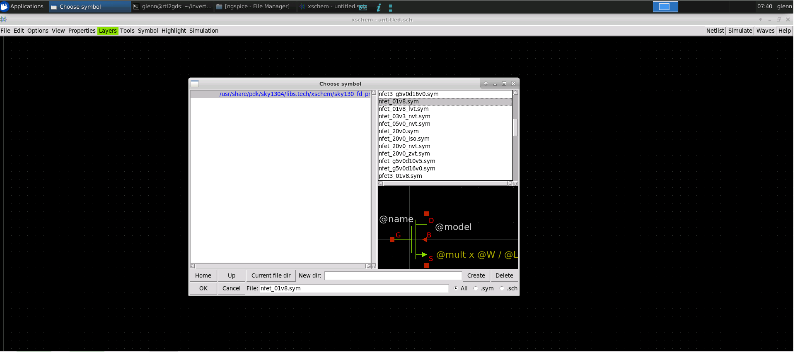
- for nfet note that in xschem w is fingers times width of device in this case 3 times 1.5 therefore 4.5
- change L to .18
- nf to 3 for pfet

- note that in xschem w is fingers times width of 
- device in this case 3 times 1 therefore 3
- change l to .18
- nf to 3

After completing the schematic we need to implement a testbench that is separate to the schematic itself. The schematic  circuit will appear as a symbol in test bench schematic
-  go to symbol and click on make symbol from schematic then click ok to create a symbol for inverter circuit
-  create a new schematic for the testbench 
-  to insert the inverter symbol press insert in the keyboard go to the current directory select inverter.sym then press ok-

Here we save the schematic by going to file menu then click save as change the name to inverter.sch
- by default the local is chosen so click ok
- xschem press insert key in the keyboard
- xschem library default library contains non pdk specific item like input output pins, power supply and test benchcomponents

##### Creating Symbol And Exporting Schematic In Xschem


To ceate and export schematic in xschem do the following:
- hover into the symbol and press m to move the symbol
- press c to copy
- press w to wireup the components
- select the symbol then press q to change the name

- the test bench is pretty straight forward set a powersupply then ramp the input then watch the output response
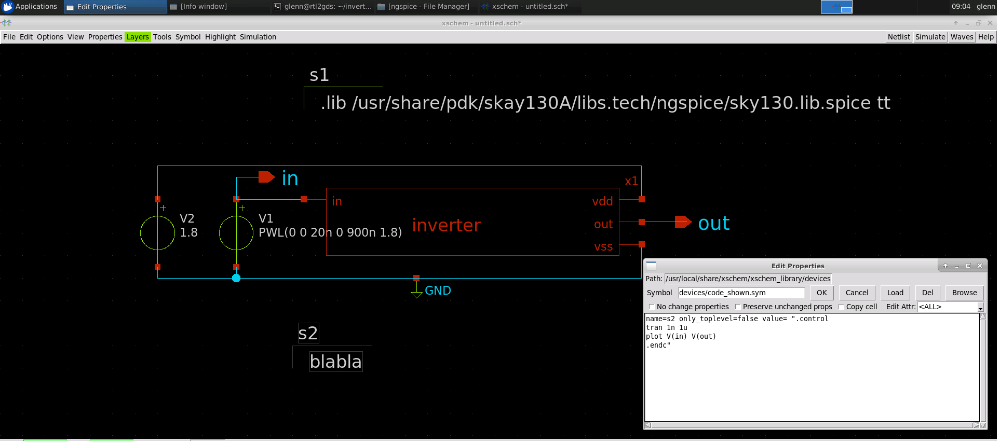
- vsource.sym for powersupply in default library
- gnd.sym for ground
- create pins for the signal that you want to see in ngspice which is going to be the in and out
- we will use opin.sym for this

- now to make a proper spice testbench it needs to have something telling it how to do the spice analysis.

- the first thing to do is to set the voltage sources
- change the power supply value to 1.8 since this uses love voltage transistors which is capable of 1.8v
- for the input set the voltage sweep to a value use a piecewise linear function write as shown.
- ```PWL(0 0 20n 0 900n 1.8)```

Now will need 2 more statement in the ouput spice netlist. because these wont be related to any components they need to be put into textblock to appear in the output. go to the libraries and select code_shown.sym. The first one will tell ngspice where to find the device model for the devices that are use in the schematic. we'll use a .lib statement that select the toplevel file telling ngspice where to find all the models but also specifying the simulation corner for the models. we'll use the typical corner so the statement will be
- plot V(in) V(out) endc"which will run a transient simulation for 1 microsecond and plot the values for signal in and out. you can put new line for the block statement as long as the whole thing is surrounded by quotes then do a save as inverter_tb.sch
- to simulate all you need to do is to click on netlist, to get the netlist and then click simulate to run simulate
- the simulation will take awhile to startup because ngspice wants to read in all of the skywater model not just the one we are simulating . once its done it will plot the input vs output.will take a while to the line should cross at 0.8v
- after verifying the simulation close the ngspice but dont exit xschem just yet

- now the circuit has been funtionally validated through simulation we need to create a layout will need a netlist that is not the complete testbench but just the circuit it self. to do this go back to editing the inverter schematic which you can do through the menu file click open go to working directory then select inverter.sch then click ok

Open magic again go to the file menu and import spice from the pop up window move to the xschem directory where the netlist was save then select inverter.spicethe schematic import does not know how to do the analog place and route because that is very hard to implement but what magic can do is find all the device in the netlist and create them with the same parameters and drop them on a layout. It is up to you now to put them in the best position and wire them up. move the cursor to the npin then press i in the keyboard to select the instance then move the cursor above the nfet then press m to move pfet.

There are some parameter that will make it much more convenient to wire this thing up. These parameter don't show up in schematic entry so you can only adjust them as needed in the layout. on the pfet device select top guard ring via coverage and type 100. this will make a local interconnect to metal 1 via at the top of the guard ring for source via coverage plus 40 for drain via coverage use -40 this will split the drain contact and move 1 to the top and the other to the bottom making it easy to connect them with the 
horizontal metal 1 wire do the same for the nfet device for source via coverage plus 40 for drain via coverage use -40 except for bottom guard ring via coverage set to 100

##### Importing Schematic To Layout And Inverter Layout Steps


There is one detail that's need to be taken care of which is to go to the simulation menu and click on LVS netlist top level is a circuit. This will ensure that we properly define the subcircuit for creating a layout cell with pins on the layout press the simulation menu again and check to make sure it is selected by verifying there is a check mark before LVS netlist. once it's done click on netlist again. Then you may exit from xschem.

- after save and overwrite do not save and exit yet on the tkcon window type
- ```extract do local``` - make sure file is written in the local directory
- ```extract all``` = does the extraction
- the output is in the ext format but we want spice  format
- ext2spice lvs which sets up the netlist generator for hirarchical spice output in ngspice format with no parasitic component which is good for simulation but not for running lvs
- ext2spice which create the spice netlist


##### Final DRC/LVS Checks And Post Layout Simulations


- ```netgen -batch lvs "..mag/inverter.spice inverter" "../xschem/inverter.spice inverter"```
-always use the layout netlist first then the schematic second so that you always know that on the side by side result the lest is the layout and the right is the schematic. each netlist is represented by a pair of keyword in quotes where the first is the location of the netlist file and the second is the name of the subcircuit to compare.

- this adds parasitic capacitance in the spice file
to view type ```vi inverter.spice```

### Day 2

##### Fundamentals of Physical Verification

DRC and LVS are the two primary aspect of physical verification. The DRC make sure that the design layout meets all the silicon foundry rules for mask making. While Layout vs. Schematic (LVS) make sure the layout design electrically matches the implemented schematic form. 

##### Data Formats and GDSII

To describe an integrated circuit a standardize file format is needed.
The common file formats are:
    - Caltech Intermediate form (.cif)
    - GDSII stream format
    - Open Artwork System Interchange Standard (OASIS)
##### Lab 1 - GDS read and Input Styles

Here we explore the cif styles in Magic. To view styles, we use the command `cif listall istyle`. We can also see the current style by using `cif list istyle`. The default style is sky130(vendor).
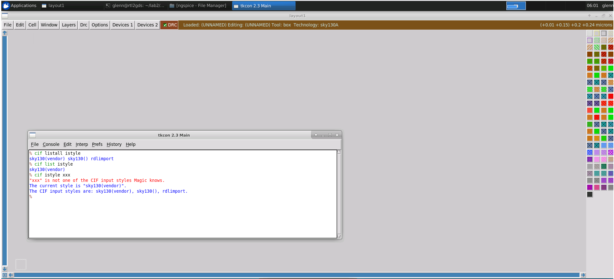
Here we read the GDS files from the PDK using the command `gds read /usr/share/pdk/sky130A/libs.ref/sky130_fd_sc_hd/gds/sky130_fd_sc_hd.gds` in the magic console. Since it is a library, the console lists all the subcells. 

To see the available top level cells, we can run the command `cellname top`.
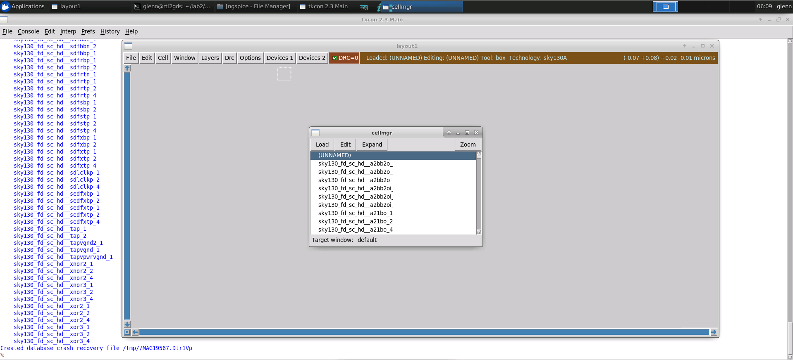
We can also use the GUI in the menu button Options > Cell Manager. We shall load a simple and2_1 cell
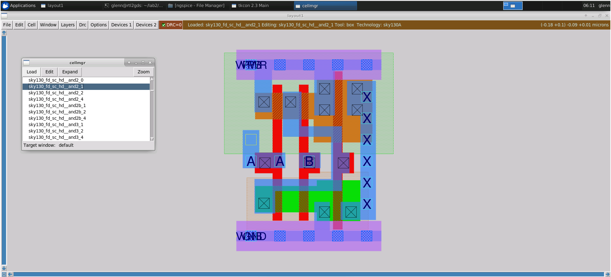
After running the script notice the port 1 name is no longer vpwr. it is now A which matches the subcircuit in the spice file we were looking at. so the port anotation was successful

 Yoy can use the `gds noduplicates true` option if you do not want to automatically overwrite existing cells when reading from gds, and then read the file again. 

##### Lab 2 - Ports and Port Indexes


We can select a port then use the command `port index` in the magic console if we want to inquire about ports on a layout. The caviat is we can only select one port at a time. 

To overcome this we use the command `port first` to find the index of the first port. Then we can then inquire about the port with the commands below.

```
port 1 name
port 1 class
port 1 use
```

Here we open the spice file to view the order of ports and for us to compare the order of ports provided by the layout information.

Here we look at the and2_1 subcircuit definition by locating the library directory and opening the file labeled sky130_fd_sc_hd.spice. Here, if we search for the and2_1 cell definition, we can see the following.

##### Lab 3 - Abstract Views

- abstract view has something to do with reading a lef file

- port 3 is x which does not match the spice netlist because port order is not part of lef file meta data magic just assign port as it read the lef file

- it seems that the port order can be solve by readspice command

- ```cif istyle sky130(vendor)```
- ```gds readonly true```
- ```gds rescale false```
- ```gds read /usr/share/pdk/sky130A/libs.ref/sky130_fd_sc_hd/gds/sky130_fd_sc_hd.gds```
- ```lef read /usr/share/pdk/sky130A/libs.ref/sky130_fd_sc_hd/lef/sky130_fd_sc_hd.lef```
- ```readspice /usr/share/pdk/sky130A/libs.ref/sky130_fd_sc_hd/spice/sky130_fd_sc_hd.spice```


- then save to save mag file

- then compare by
- ```vi /usr//share/pdk/sky130A/libs.ref/sky130_fd_sc_hd/mag/sky130_fd_sc_hd__and2_1.mag```
- 
##### Lab 4 - Basic Extraction

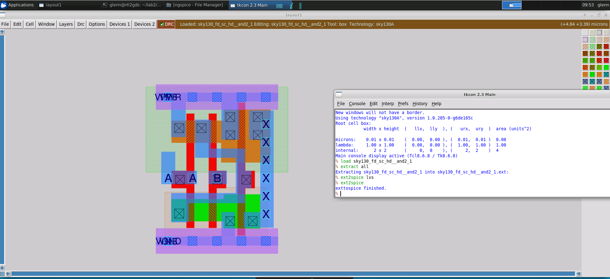
- compare spice generated from layout and spice from library

- -diff -y sky130_fd_sc_hd__and2_1.spice /usr/share/pdk/sky130A/libs.ref/sky130_fd_sc_hd/spice/sky130_fd_sc_hd.spice

Here are the R and C parasitic components generated in spice using Magic.
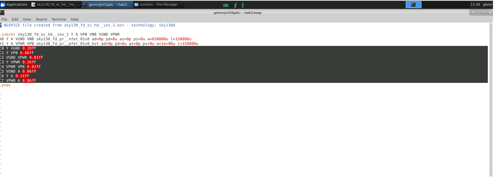

The commands shown are use to include extresist in the extract file and then to spice file.

Including the ext2resist is extremely time consuming for large circuits. For large circuits, it is better to let the router conduct this job as it already knows where all wires are supposed to connect.

##### lab 5 - Setup for DRC


The reason we haven't seen these DRC errors earlier in Magic is because the DRC script runs a full DRC check, while the default DRC style in Magic was a fast DRC. 

##### Lab 6 - Setup for LVS


Here we create a subdirectory for Netgen. Next, we copy the Netgen setup and run Netgen on the and2_1 netlist files. We do this using the following commands.

##### Lab 7 - Setup for XOR


To compare a layout an xor method is use. Here I load an inverter and make a cut of the materials and save.

I then compare the cut inverter to the original one. Here you can see the xor result. XOR operations are very useful to find such mistakes. Since, these kind of mistakes can easily occur while adjusting layouts by human intervention

### Day 3
### Fundamentals of Design Rule Checking

Every silicon manufacturing process has its own tolerances on the designs being manufactured. These tolerances are dependant on the conditions and machines used in the fabrication environment, and are based on probabilities of expected failure/defects found in a manufactured batch, in parts per million. Thus, each process has its own set of rules that need to be adhered to, and these rules are given on the geometry of the layout to prevent chip failure. These are known as design rules, and the process of adhering to these rules is done by design rule checking.

The SkyWater process design rules can be found in detail [here](https://skywater-pdk.readthedocs.io/en/latest/rules.html).

### Back-end Metal Layer Rules

**1. Width Rule**
* Gives the minimum width of a layer.
* Not adhering to this can cause spot defects to be larger than the width of the layer itself, causing open circuits in wires.
* Minimum width for implants are given based on angle of implant and crystalline structure of the silicon. Implants in layer with very small widths may not act like they are supposed to.
* Feature size of a process gives the minimum width of a transistor (or its polysilicon layer)

**2. Spacing Rule**
* Gives the minimum spacing between two layers.
* Not adhering to spacing rales may cause material defects creating shorts between layers.
* Has several complications based on optical effects of the mask.

**3. Wide-Spacing Rule**
* If a wire or piece of layout is wider than a given distance, then other wires of any width must be kept away from it by an additional amount of space.

**4. Notch Rule**
* Similar to the spacing rule (generally the same in most processes).
* Gives the minimum space between two forks of the same piece of layer.

**5. Minimum and Maximum Area Rules**
* Gives the minimum and maximum areas for a metal layer.
* Prevents delamination issues in the metal surface.
* Implants only have minimum area rules, due to concerns same as that of the width rule.

**6. Minimum Hole Area Rule**
* Gives the minimum are a hole in a metal layer must be.
* Small holes in a metal layer make it more likely that oxide grown over the hole may not completely fill it.

**7. Contact Cut Rules**
* A Via is the contact cuts made between metal layers to connect them using other metals.
* As the holes connect layers from above and below, their positioning is critical.
* Contact cut rules ensure masks can be positioned correctly.
* Contact cuts must be surrounded by a minimum amount of metal around them.
* Magic displays arrays of contact cuts for the same layer to layer connect as a single large contact cut (via) for design simplicity.

### Local Interconnect Rules

Most foundry processes go directly from polysilicon layers to aluminium (metal1). SkyWater uses local interconnect layers as routing layers between polysilicon and metal layers. Rules for this layer are based on physical properties of the material, mainly its resistance per square.

The aspect ratio of any uncontacted local interconnect layer should generally be greater than 1:10. Generally, local interconnect should only be used to connect nearby layers and not for longer routing.

### Front-end Rules

These are rules that are device specific, and generally do not need to be handled with unless designing standard cells or designing special layouts that don't use standard cells. In Magic, the user can use the parameterized device generator which will automatically generate a device that satisfies and adheres to these device specific rules.

MOSFET transistors have minimum gate width and length rules to account for the alignment between the diffusion and polysilicon masks. There are also field poly to diffusion spacing rules to prevent accidental transistors from forming. The gate poly to diffusion contact rule specifies how close the drain and source contacts can get to the gate.

### Wells, Taps and Net Rules

A tap is a region of diffusion that is doped with the opposite implant type of the transistor source or drain. Taps sit inside wells, and are of the same doping type as the well, making them electrically connected. The tap forms a connection to the well to set the bias voltage specifically, so that the p-n junction formed between the transistor and its surroundings is firmly reverse biased, keeping the transistor from leaking more than an acceptable amount of current.

Standard cell taps follow one set of rules which keeps p and n type diffusions separated from them by a minimum amount of distance, known as the diffusion to tap spacing rule. There are also butted taps, which keep the p and n taps sharing the same diffusion region, and have extra rules associated with them.

Same-net spacing rules pertain to wells, most often applied if two n-well regions on different nets must have extra spacing between them, more than the minimum specified spacing between any 2 n wells.

### Deeps N-Well and High Voltage Rules

Deep n-wells are used to decrease noise coupling effects in p substrates from nmos devices. These wells have a number of design rules associated with them. Deep n-wells have large minimum width requirements, as well as very large minimum spacing requirements between 2 distinct deep n-wells.. They must also have a fence of n-well around it that overlaps by a minimum amount on both the inside and outside.

High voltage implants in transistors allow the n-well under the p type transistor, as well as the source and drain of both n and p type transistors to be tolerant of higher voltages. High voltage transistors also require thicker gate oxide layers to prevent gate punch through at higher voltages. Since the high voltage layer directly affects the transistor, it comes with a number of rules. First, the diffusion layers have greater space and width requirements. N-wells have greater spacing requirements, both to themselves and low voltage wells, and transistor gates have to be both wider and longer.

### Device Rules

Resistors are very complicated in the SkyWater process, and have many associated design rules. Resistors can be made with diffusion layers, polysilicon layers or p-well regions deep inside n-wells. Certain polysilicon resistors have specific design rules, such as the contact cuts must be rectangular and not square. Though, generally most designers will use the pdk design generator in magic to create resistor designs that adhere to design rules.

Capacitors come in 4 distinct types in the SkyWater process; Varactors, MOScap, Vertical Parallel Plate (VPP), Metal-insulator-Metal (MiM). Varactors share similar DRC rules to MOSFETs, but with some different requirements to width, length, gate extension and contact distance from the gate. MOScaps follow the same DRC rules as MOSFETs. VPPs are also called Metal-Oxide-Metal (MOM) capacitors, and just follow the DRC rules for metal layers such as width and spacing. MiM capacitors boast much higher capacitance per unit area values than regular MOM capacitors, and have minimum and maximum width rules for the inside capacitor plate, as well as requirements for the metal plate underneath to have a certain amount of surrounding material. MiM capacitors also have aspect ratio rules, and bottom and top layer rules, and are subject to antenna rules as well.

Diodes are formed by the p-n junction between the diffusion and well. These are usually unwanted parasitic devices since they are formed whenever you place down a transistor, n-well or deep n-well. When placing diodes, they follow similar DRC rules as those of diffusion, tap and well layers. They can also be used to overcome antenna rule violations.

Certain devices have reference layouts created by the foundry itself, and are guaranteed to be to DRC correct, as long a the designer follows spacing requirements between these and other devices. These devices are called fixed layout devices.

### Miscellaneous Rules and Latch-up, Antenna and Stress Rules

Some rules in the SkyWater process are not layer specific. Off grid rule specifies that all geometry in a design layout must have vertex coordinates that fall on a grid point in the manufacturing grid. Any non-manhattan shapes must have vertices that fall on grid points only. Angle limitation rules demand certain layers to have only manhattan geometry, while the others are limited to only 45 degree geometry. Seal rings have certain design rules of themselves, but magic presents DRC correct seal ring layouts that fit the dimensions of the chip automatically.

When a parasitic p-n junction becomes forward biased, it creates a condition called Latch-up. This can cause effectively pnp and npn transistors to form across the well, tap and substrate layers, thus shorting the entire chip and causing it to get stuck in this state till the power supply is removed. Thus, design rules for latch-up conditions specify a minimum distance between a tap connection and diffusion region anywhere on the design.

Antenna rules dictate how to avoid electrical manufacturing failures, and depend on chip layout at specific points during the manufacturing process. For example, large portions of routing material can build charge during the manufacturing process and then cause high voltage punch throughs in components nearby, such as transistor gates. Thus, antenna rules apply to any long strips of material with one end tied to a transistor gate and the other rule untied, or tied to another layer above it. One way to avoid antenna violations is to provide a path to ground through a parasitic p-n junction of diffusion, anywhere on the material that violates the rule.

Stress rules are related to metal delamination, and metal cracking and other damage caused by stress on the chip during wire bonding and sawing. To mitigate this we have slotting rules, which state that wide metal layers should be perforated with slots to keep any part of the metal from exceeding some maximum width. These slots should be in the direction of current flow.

### Density Rules

Metal route layers that are not flat can cause layers above them to not be deposited as flat surface either. Metal layers undergo a polishing step, though the existing metal before polishing must have a certain amount of flatness as well. Oxide layers are added between metal layers, that deposit in a snow coverage-like pattern. If there are large spaces 2 metal routes on the same layer, the oxide layer will have bumps, and subsequent layers created above them too. To overcome this, fill material is used between the gaps of the metal, to achieve a certain 'density' of material.

There are automated tools that can generate fill patterns in a layout to meet density requirements. Though in analog designs, fill patterns can create unwanted capacitances hat are difficult to analyse. There are certain conditions where 2 metal layers are just spaced apart enough that there isn't enough room between them to add fill material, yet there is enough space to cause bumps in the layers above.

### Recommended, Manufacturing and ERC Rules

Recommended rules are design rules that can be followed to make a design more robust, and improve yield. These include rules such as having more than one contact cut per via, and violating these will not cause the foundry to reject the design. Though, as recommended rules increase production yield, they are very handy for production designs.

When creating test designs however, the bare minimum rules that must be followed so that the foundry does not immediately reject your design are called Manufacturing rules. These are listed below.
- Width rules
- Spacing (notch) rules
- Minimum area rules
- Overlap (surround) rules
- Extension rules
- Angle and off-grid rules
- Density rules (acceptable, rarely)

Rule violations that persist in the final design require a waiver from the manufacturer, which is a statement that verifies that the customer holds full liability for any risks arising from such violations and not the foundry.

Electrical Rule Checks (ERC) are checks for a layout that is DRC correct but cause certain failure due to electrical problems. These are,
1. Electromigration (max. current density) - damage to metal wires for carrying too much current over a period of time
2. Overvoltage conditions - occur especially when high and low voltage circuit designs are combined

##### Lab 1 For Width Rule And Spacing Rule

In this exercise the width of metal 2 is below 0.14 micrometer which is a DRC violation. To increase just type ```:box width 0.14um``` in the console then hit enter to adjust the width of the metal selected and type ```:paint m2``` to paint metal 2.

In this exercise the spacing of metal 1 is below 0.14 micrometer which is a DRC violation. To increase the spacing between metal 1 I just select the metal 1 on the right side and move further to the right until the DRC error is gone.
##### Lab 2 For Wide Spacing Rule And Notch Rule

In this exercise the spacing of metal 3 is below 0.3 micrometer which is a DRC violation. To increase the spacing between metal 3 I just select the smaller metal 3 on the right side and move further to the right until the DRC error is gone.

In this exercise the notch of metal 4 is below 0.3 micrometer which is a DRC violation. To increase the notch between of metal 4 I just select the upper part of metal 4 on the  stretch further up until the DRC error is gone.
##### Lab 3 For Via Size, Multiple Vias, Via Overlap and Autogenerate Vias


In this exercise the metal connect 1 is below 0.17 micrometer which is a DRC violation. To increase the width I stretch to the right to increase the width and stretch up to increase height. 

To see the MCON just type ```cif see MCON``` in the console.
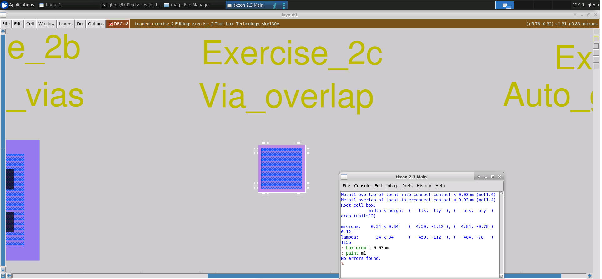
In this exercise the overlap of metal 1 to metal interconnect is below 0.3 micrometer which is a DRC violation. To increase the size we just have to select metal 1 and type  ```:box width 0.3um``` in the console then hit enter to adjust the width of the metal selected and type ```:paint m1``` to paint metal 1.

To automatically generate a via in Magic without any box manipulation we can use the wiring tool by cycling through the tools with the space key, we can quickly draw wires. By clicking SHIFT+left MB we can move up a metal layer until we reach the top most metal 5 layer. Similarly, we can move down layers with the SHIFT+right MB until we reach the metal interconnect. We can check the vias and mcon generated by the commands shown.
##### Lab 4 For Minumum Area Rule And Minimum Hole Rule

In exercise 3 the minimum area of metal 4 is 0.24 micrometer squared and the minimum area of the hole of metal 1 is greater than 0.14 micrometer squaresd which are both a DRC violation.

As for metal 3 stretching the area to the left until the error is gone is enough. 

As for metal 1 we just have to increase the hole greater than 0.14 micrometer squared by drawing a square inside the hole greater than 0.14 and right clicking the empty canvass to generate a bigger hole.
##### Lab 5 For Wells And Deep N-Well

In exercise 5 we are presented with wells and deep n-well problem.

- For exercise 5a n well must not be floating, so the tap should be connected to a layer of local interconnect. So we must paint a layer of nsubstrate diffusion of top of n well and then nsubstratencontact on top of nsubstrate difffusion which will serve as a gateway to local interconnect. While this gets rid of the n-well DRC error, it creates smaller errors of overlap and surround. By stretching the nsubstrate diffusion we git rid of this error. 
- Similarly for exercise 5b p well must not be floating, so the tap should be connected to a layer of local interconnect. So we must paint a layer of psubstrate diffusion of top of p well and then psubstratencontact on top of psubstrate difffusion which will serve as a gateway to local interconnect. While this gets rid of the p-well DRC error, it creates smaller errors of overlap and surround. By stretching the nsubstrate diffusion we git rid of this error. 

In this exercise, the deep n-well in 4c have the following DRC errors. Deep n well width less than 3 um and deep n well spacing less than 4.5um. We can get rid of this by moving the deep n well to the right further than 4.5um away from the n well. Then paint the width of n well above 3um. Now we also have an Nwell overlap error of less than 0.4 um. We can get rid of this by adding an n well overlap around the deep n well. We can do this by painting in a n well layer around using the wire tool to draw the rest of it.
##### Lab 6 For Derived Layers

In this exercise we have a generated derived layers.

In 5a the derived layer is an lvtnmos. We can recreate this by painting a layer of ndiff and poly on top of each other as shown and see what the overlapping layer becomes. In this case we generated an nmos because of the default instruction in the tech file. To get a layer of nmoslvt, we must specifically paint in a layer of nmoslvt.
- We can see the implant layers and how they are used for autogeneration. We can visualize these implant layers with the following commands as showm.

Here the high voltage implant is slightly larger than even the NSDM implant layer, though it does not cover the tap contact since the substrate is always grounded so it technically never gets to see high voltage. For that, there is a high voltage tap and tap contact type which can be painted over the existing tap. Then we look at the implant layer, we can see the HVI implant at the tap as well.
HVI layers must always be kept a certain distance away from regular low voltage layers. We can add a layer of regular ndiff material above to get rid of the following DRC error. Because it is a derived layer, the DRC error is also a combination of 2 different design rules.

In exercise 5c, poly contacts need a special type of layer etch and not an implant, called NPC or nitride poly cut. The NPC etches through any nitride residue on the poly to ensure firmer contact between the poly and local interconnect. We can see this using with the command shown. As for the second set of contacts, the NPC layer must bridge between the two contacts to avoid spacing rule errors. As for the third set of contacts, magic must generate additional geometry for the NPC layer to satisfy all width and spacing rules. And lastly, in the 4th set of contacts we also get additional geometry that may overlap regular diff layers, but still satisfy all design rules.
##### Lab 7 For Paramterized And PDK Devices

In this exercise we have parameterized which is a device create automatically using magic and pdk devices.

This is simple nmos (MOSFET) device created from the Devices 1 menu with default parameters. Although this is a Magic generated device, it still shows up as having DRC errors. The error is a metal minimum area error, and magic could avoided by adding more metal to the layer. We can rix this by painting in some metal 1 over the contacts.

Though, if we descend into the subcell with the > key, we can see that the DRC error does exist.
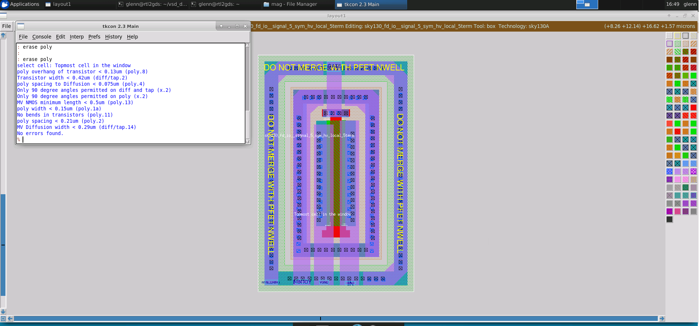
In exercise 6b, we have an esdfet designed to survive high voltages, and it purposefully breaks design rules. It has a transistor gate at an angle, which is not allowed. The only way in Magic to ignore rule errors for a device that is known good, is to abstract it. Though abstract views are in a separate lef directory, but that is not what is needed here. All library views are abstract in a way, because they contain pointers to gds files, and thus what is shown is no more than Magic's best attempt to represent the gds data. We can change the layout without changing what is written out to gds, which is dangerous and generally only used for read only files that do not get affected. We can, however, use this to our advantage by making the layout look DRC clean and not flag false positives. First, we select the cell with the I key, check its file path and change it to the current working directory. Next, we descend into the cell and save it to disk. Now, we can confirm that the cell still points to a valid gds file with the property command. Now we can start to clear the DRC errors by selecting and erasing the angled poly sections in the layout with the erase poly command. We should now see no DRC errors.

In exercise 6c we can do the same method in 6b to get rid of the DRC error.
##### Lab 8 For Angle Error And Overlap Rule


In this exercise I get rid of the DRC error by moving metal 1 to the left as shown.

In this exercise I get rid of the DRC error by painting a square metal interconnect on top of the metal interconnect given.

In this exercise I get rid of the DRC error by painting a square metal 1 on top of the metal 1 given.

In This exercise, we can see that overlaps in contacts have different rules. If contacts overlap, they must overlap exactly, for the automatic generation rules. In this example, if we look at the contact cuts, we can see the following. Here the overlapping contact cut has been pushed over to align properly.

In this exercise, we have an overlap error. This is because the poly and diff layers are in different cells, and then made to overlap. While this should create a transistor in the overlap, because the two layers are in different cells, Magic does not allow this. To fix this is to just paint over the poly subcell again with a layer of poly, and preferably delete the old poly subcell layer. This creates a nmos as shown. If we push into one of the contact layers, we can see that here the contact cuts are aligned perfectly, and in the top level cell the cuts had to have been arranged differently to be error free. To fix this, we can flatten it. The flattened copy now is DRC free, as both contacts are now in the same layer and there is no concern of overlap. In the next contact layout, we have to VIAs with square contacts that are not aligned properly.
##### Lab 9 For Unimplemented Rules

In this exercise we have a seal ring. Seal rings are just layers that have no electrical meaning, and are just a physical barrier between the chip and the outside world. These seal ring layers break multiple design rules, and are not worth the effort to include in the tech file. Thus, Magic shows these seal rings as a kind of abstract view which is designed to be DRC free, with no properties associated with it. If you try to paint diffusion layers over this, you will get overlap errors.

So the SkyWater PDK actually has a seal ring generator that can generate gds correct seal rings, though these cannot be imported into Magic unless as abstract views. To generate seal rings, all we need to know is the size of the outer edge of our pad frame. We can use the seal ring generator with the command shown

As we go one layer inside we can see the case. This has something to do with the manufacturing process to indicate a margin. 

We can read the seal generated in python as shown in the console. We open up the magic console and use the command `addpath <created_directory>`, and then open up the seal ring file with `load <file_name>`. If we push into this abstract, we can actually see that the `property` command for this references the just created .gds file. Now, we can run a script launch for magic that runs magic with the appropriate tech file to view the seal ring, with the command `./gds_magic`. Now we load the gds file with `gds read seal_test/adv_6um_gen` to see the seal ring.

In this exercise we also generate the gds file of 8b.

looking into the label.
##### Lab 10 Latch-up And Antenna Rules

In this exercise, we have a layout with standard cells that violates some of the basic rules we saw earlier, as well as depicts latch-up violations.

First, we must add taps to the diffusion layers. Since it is a standard cell, it should come with a tap cell that is part of the standard cell library. We can place down the tap cell as follows. Now, we can select and move the tap cell to align it properly with the other cells, thus fixing the error.
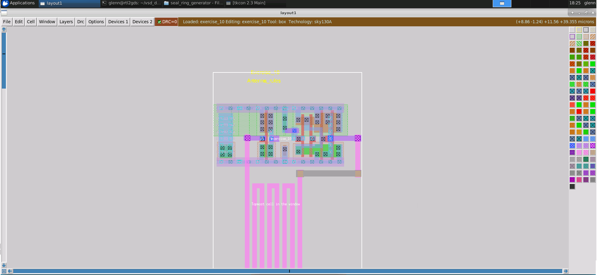
In this exercise, we can look at ERC or electrical rule checks, specifically antenna rules. Let us look at exercise10.mag, which has a few standard cell layout with very long route between them.

To run an electrical rule check, some knowledge of the circuit is required to evaluate the rule. To get knowledge of the circuit, the circuit needs to be extracted. We can extract the layout as shown.

We can run an antenna check as follows. The antenna check shows up as feedback on the layout, and we can use `feedback why`. This gives us antenna ratios that triggered the error. The ratio of the area of the metal to the area of the gate is more than twice the permissible value of 400. There are 2 ways to fix this. First, we can tie down the route to a piece of diffusion (which acts like a diode). The antenna check tells us the error is at metal2, so we can place a standard cell diffusion diode anywhere at metal2. In this example, the diode is already places on th left of the cell, and we just need to wire the input where the violation starts to the diode as shown below. The wire needs to be contacted down into the diode with the SHIFT+right MB.

Now, if we extract and run an antenna check, we see no feedback and no error message. This means the antenna violation is cleared. Another way to fix an antenna violation is to manually check the route path and fix it. First, we can hide the metal3 and via layers above the metal2 layer to get a clearer grasp of the antenna formation. This is done below. The metal2 route forms an antenna before the next layer of metal3 is fabricated over it during manufacturing. Now that we know the only thing causing the long metal2 rout to be untied during manufacturing is that single metal3 route, we can easily replace it with metal2 to ensure both ends are tied. We use the wiring tool to wire a metal1 route to avoid antenna violations. We can check and see that we now have no antenna violations, as follows.
##### Lab 11 For Density Rules

SkyWater uses a window size of 700 by 700 microns to run density checks. Let us look at exercise10.mag, which has a large layout containing metal1 and metal2 layers.
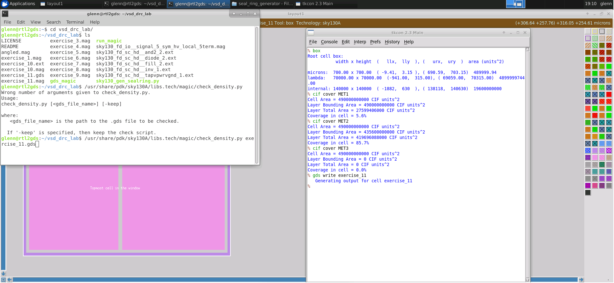
Here, the metal1 layer is just a thin section going around the layout, which depicts under-density for that metal layer. Similarly, metal2 covers pretty much the entire layout, leading to over-density for the metal2 layer. To check for density coverage, we use the following commands.

This agrees with our last point that metal1 covers only 5.6% of the cell while metal2 covers 85.7%. But foundries do not check for the average density across the whole layout, instead they do complicated calculations over fixed window sizes to find densities. Hence, we use a script to do this in Magic, using a script provided by the process PDK.

To do this, we first do gds write exercise11 in the Magic console, then open a new terminal to run the density check script as follows. If we now look at the results, we can see the following errors. Here, we see the fill patterns generated for the entire layout. To see only a specific layer, for example metal2, we use the commands below. First we hide all layers, then show m2fill layer which is a special fill layer for metal2.

Next, we must merge the patterns with the original layout. To this, we load the exercise_11.mag file again. We have to ensure that while merging, the position of both the layout and fill patterns align properly. To do this, we follow the steps below.

Now, we can view just the metal2 layer in the layout to confirm that the fill patterns align perfectly after the merge.

Now, we can check for density coverage again by setting the cif output style to density. This is done so that the cover command checks for both the metal and fill layers instead of just the metal, and is done as follows. As we see above, metal1 density is now within the permissible limits. However, metal2 is still way out of bounds, since not much can be done to fix over-density apart from physically removing metal layers from the design. The other layers like metal3 have now been filled as well, so they are all within the permissible density limits, instead of being empty with 0% density.
##### Lab 12 Final Exercise

This is our final exercise in day 3

We must get rid of the following DRC errors.
### Day 4
##### OpenLane/OpenRoad Automation

OpenLane flow is an RTL2GDS tool that uses several tool from synthesis, floorplan, placement, clock tree synthesis, routing, GDS generation to checkng. Below are the process flow and corresponding tools.
##### Synthesis
- yosys - Performs RTL synthesis
- abc - Performs technology mapping
- OpenSTA - Performs static timing analysis on the resulting netlist to generate timing reports
##### Floorplan and PDN
- init_fp - Defines the core area for the macro as well as the rows (used for placement) and the tracks (used for routing)
- ioplacer - Places the macro input and output ports
- pdn - Generates the power distribution network
- tapcell - Inserts welltap and decap cells in the floorplan
##### Placement
- RePLace - Performs global placement
- Resizer - Performs optional optimizations on the design
- OpenDP - Perfroms detailed placement to legalize the globally placed components
##### CTS
- TritonCTS - Synthesizes the clock distribution network (the clock tree)
##### Routing
- FastRoute - Performs global routing to generate a guide file for the detailed router
- CU-GR - Another option for performing global routing.
- TritonRoute - Performs detailed routing
- SPEF-Extractor - Performs SPEF extraction
##### GDSII Generation
- Magic - Streams out the final GDSII layout file from the routed def
- Klayout - Streams out the final GDSII layout file from the routed def as a back-up
- Checks
- Magic - Performs DRC Checks & Antenna Checks
- Klayout - Performs DRC Checks
- Netgen - Performs LVS Checks
- CVC - Performs Circuit Validity Checks
##### OpenLane flow - non-interactive

To run open lane typr ```make mount``` to open a docker then run ```./flow.tcl -design (design_name) -tag (reslult_name)```. The flow.tcl is where the sequence of program is run using the script tcl. As shown the flow must run in sequence from run_synthesis, then run_floorplan, then run_placement and so on. You can not jump from run_placement without running run_synthesis and the run_floorplan. flow.tcl can run in noninteractive which is the default and  interactive which must be pass as an argument.

After running the noninteractive mode the gds file and a mag file is generated from spm.v; verilog file. This is the layout is shown using magic a layout editor. As shown the generation of GDS from RTL is pretty straight forward as simple as runnging the script but generate a well designed GDS we must understand how the openlane run in interactive mode.
##### OpenLane flow - interactive 

To run interactive we type ```./flow.tcl -interactive```. Here we look for latest version of openlane by typing```package require openlane```. Then we choose what design we want to generate. For this example we use the spm design. Then we type ```prep -design spm -tag workshop```. The openlane then prepare the necessary lef files, standard cells, etc for the spm design.

Here as shown ```run_synthesis``` opens yosys which performs an RTL synthesis. It conversion a verilog file to a logic gates level file.

As highlighted it tracks what gate and the number of gates, number of wires, etc that it generated from the verilog file.

This is the second part of running synthesis. Here openlane opens abc program to run a technology mapping of the gates generated by yosys. 

The logic gates from an abstract gate is map to skywater 130nm technology gates.

Notice also that openlane run static timing analysis during this stage. Actually STA is run multiple times in RTL to GDS conversion. This is to make sure the file generated does not have timing problem.
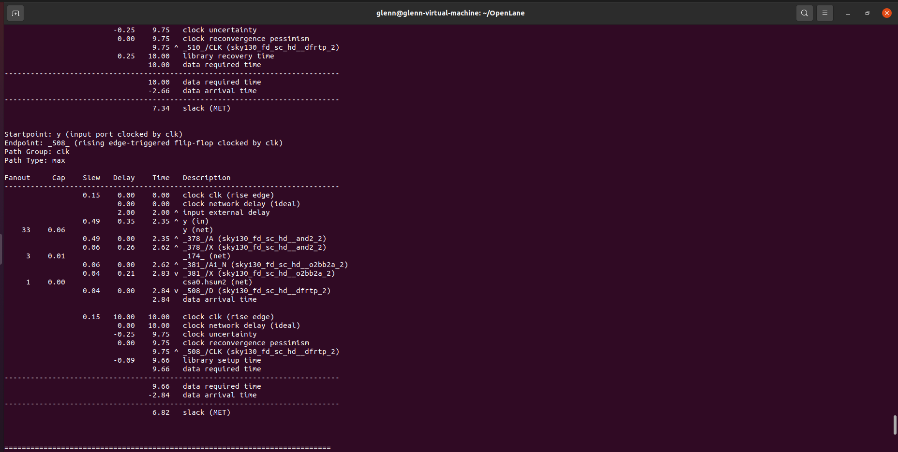
Here we have a positive slack which is an indication of no timing violation.

The next step is to invoke```run_floorplanning``` as shown.

Floorplanning determines the core area as highlighted. It also runs IO placement.

The next part is the tap and decap insertion. Then lastly it generated PDN/power grid.

Next is ```run_placement```. It first run global placement. 

As shown in the report this design has 50 percent utilizaiton. With 75 percent a sequential logic and 25 percent combinational logic. This has 0 macro and padding.
Then it runs desizer design optimization.

It then generates a verilog here it is called spm.resizer.v. Then it runs a detailed placement. Then it generates a verilog file in cts folder.

Next is ```run_cts```. Here openlane runs Tritoncts a clock tree synthesis program.

Next is ```run_resizer_timing```. As shown below we reach 51 percent utilization with 55 percent sequential and 45 percent combinational. 

Next is ```run_routing```.

before runnign routing it reruns a sequence of program for optimization.

Here it runs global routing.

Here it runs fill insertion.

Here it runs detailed routing.

Here it runs SPEF extraction

Then runs a static timing analysis once again.

Next is ```run_powered_verilog```.

Here is the result of write powered verilog. This will serve as an input for the LVS operation we need to run later.

Next is ```run_magic```. This wil streamout GDSII file.

Next is ```run_antenna_check```. This make sure there is no antenna violations.

Then lastly we can generate report using ```generate_report```.
##### Techniques To Avoid Common DRC Error & Techniques To Manually Fix Violations

For out task we are given two assignment. The first task is to make the DRC error into zero without manually fixing violations. Here we can achieve this by changing the utilizaiton factor in the config.tcl script of task 1.
As for task 2 we have to run magic after generating the GDS file to make manual correction. In magic we first need to go to option the complete DRC. Then in the console type DRC check. This will tell Magic to run full DRC. we then ask Magic what is the problem by typing ```?``` in the console. Then go to the file by typing ```feedback why``` and ```Go to (metal name)``` then control z to zoom to the component. From there you can now manually adjust the size as taught in the previous lab uusing magic.

### Day 5

### Fundamentals of LVS

LVS and DRC are the 2 principle forms of sign-off validation before sending a chip for fabrication to the foundry. While the foundry will perform a full DRC on your design, they do not perform LVS, since the foundry has no way of knowing the behaviour/function of your design or what it is supposed to do. If your design does not meet LVS however, it has the potential to come back from manufacturing just as dead as a chip that fails DRC would.

LVS tools are extremely fast and efficient at doing 1 thing, and that is to tell you whether the 2 netlists match or not. However, when netlists do not match, these tools are extremely poor at telling you the exact reason for it. Thus, knowing how to read and the results of a LVS tool and figure out what the problem is, is paramount for a verification engineer.

Any LVS tool needs the schematic and layout netlists, and traditionally, netlists used for this purpose are in .spice format, though any format with enough information on the circuit will work just fine (lef/def, verilog, blif, etc). Netgen accepts spice and verilog formats, which are both simulatable.

The traditional LVS flow follows a schematic tapture, where the schematic is converted to a netlist. An alternative to this, is to start from RTL verilog instead, which is a behavioural description and not physical description of the design. In this case, synthesis tools like yosys are used which map behavioural verilog to gate level netlists. This netlist goes through a synthesis back end to be layout compatible.

### Schematics and LVS Matching

An important part of creating schematics for larger projects, is keeping the hierarchy of a schematic matched to the hierarchy of the layout. Though generally, layouts tend to have more hierarchical layers due to bundling of similar cells, guard rings, etc; but the LVS tool is designed to deal with extra layers of hierarchy. Hierarchy makes good practice, since working through LVS at a block level is much easier than working through it at a transistor level. Errors can easily be contained in blocks and pinpointed.

The way LVS matching works, in simple terms, is to check for devices and nets. If a device in both netlists 'looks the same', which means it has the same type of nets connected to device terminals it may be the same. Similarly, if a net in both netlists is connected to the same type of device, both nets may be the same as well.

### LVS Netlists Vs. Simulation Netlists

|Netlist for LVS|Netlist for Simulation|
|-|-|
|Devices in design|Devices in design|
|Basic parameters|All parameters|
||Parasitic capacitors|
||Parasitic resistors|
|Nets in design|Nets rewired around parasitic resistors|
||Parasitic Inductors|
||Parasitic mutual inductance|

Netlists for simulation contain parasitics for more accurate simulations of chip behaviour. These parasitics come from the physical arrangement of the layout, and do not exist in the schematic. Since the LVS tool will see these parasitics as separate components, the design will instantly fail the LVS check due to a different number of components. So, any netlist passed to an LVS tool should be created without parasitics. In magic, to prepare LVS netlists we must only use the following extraction commands.

```
extract do local
extract all
ext2spice lvs
ext2spice
```

### Running Netgen

Netgen is an extension Tcl/Tk interpreter language, and as such, all netgen commands share Tcl/Tk syntax.

The shell command line for running Netgen can be either of the 3 types below.

```
netgen -batch lvs "filename1 subcircuit1" "filename2 subcircuit2" setup_file output_file
netgen -batch script_file
netgen -batch netgen_command
```

### Netgen Matching Algorithm

The way the core netgen algorithm works is in iterations. In the first iteration, netgen creates 2 lists, one with all devices in both netlists (and/or subcircuits if any), and one with all nets from both netlists. These lists are called partitions, though nothing has been partitioned yet on the first iteration. Next, each device in the device list gets assigned a number, which is the hash of the dvice name. Each of the device's pins get assigned a number, which is a hash of the pin name. It is necessary to ensure that devices and pins in one netlist which are supposed to be the same as devices and pins in the other netlist have the same hash number. Which means lowest level devices in both netlists must have the same device and pin names.

Next, netgen runs through all of the nets in the list of nets, and assigns them a hash number that is based on a combination of the hash numbers assigned to each of the pins that the net is connected to. So, all nets that are connected to the same pins of the same devices, get the same hash number.

Next, Netgen runs through all of the devices in the device list and assigns them a hash number based on the hash numbers of each of the nets that the pins of the devices are connected to.

After this, netgen creates a group of nets, all of which have the same hash number, and a group of devices, all of which have the same hash number. These groups are called partitions. Each partition is like an independent netlist and netgen can repeat the procedure for each of the nets and devices in each partition, causing partitions to divide further. Ideally, the process ends when there are as many partitions as there are devices and nets. Which means each partition contains exactly 2 nets or devices, one belonging to the first netlist and the other belonging to the second. In this case, netgen has found a unique 1:1 match for every device and every net in the circuits.

Any partition that contains a different number of devices or nets from one netlist compared to the other, indicates a mismatch. If any iteration does not create new partitions, but there are still partitions that have more than 1 entry from the same netlist, means there is an error. In this case, netgen then dumps the contents of all partitions that are not 1 to 1. Though these partition dumps give no information as to how are why there is a mismatch.

### Pre-Matching Analysis and Hierarchical Checking

An issue with the core matching algorithm is that the output can get very large, very quickly if there are a large number of devices and nets in the design. The best way to keep the output under control is to run a hierarchical check. This means parsing through the hierarchy of subcircuits in both netlists, and comparing each subcircuit independently. However, the hierarchy of circuit layouts and schematics do not always match, with the layouts usually having additional hierarchy. To work around this, netgen uses a pre-match analysis.

Before it starts matching, netgen takes a look at the devices on each side and try to count whether both netlists have the same number of devices or subcircuits of the same name. If it finds something in one netlist that is not in the other, then it checks to see whether one of the unmatched entries is actually a subcircuit wrapper. If it pulls the contents of a subcircuit into the parent circuit, and that made a better match, then the subcircuit was probably a wrapper. The procedure then is to flatten the subcircuit to ensure a better match. Netgen now runs this pre-match analysis till both circuits have the same number of devices of the same name on each side; or until it cannot find a better result by selectively flattening subcircuits. Thus, all subcircuit wrappers do not need to show up in the final result, except for saying that they were flattened. 

If 2 subcircuits in a schematic and layout are wired up differently, then they should also be named differently, otherwise a lot of confusion can result; though this is somewhat common. When netgen does hierarchical checks, it traverses the hierarchy from top to bottom. It then works its way back up to the top, creating a queue of subcircuits to match that are ordered from lowest to highest level. It then checks each pair of subcircuits, starting from the bottom most. If any match attempt succeeds, it treats that as validated and moves on. When a validated subcircuit appears again in later checks, it can be treated as a black box with pins since everything inside it has already been confirmed matching on both sides. If this match attempt for a subcircuit fails, then netgen automatically flattens its contents and dups then in the parent cell, everywhere in the design.

When flattening contents like such, if there is a real error across both netlists, the error propagates up the hierarchy, flagging issues up to higher level cells as well. Since this beats the whole concept of hierarchical checking, there are 2 methods to counteract this. The first is to concentrate efforts on matching lower level cells first. This is because once lower level cells are fixed, running LVS on the netlists again may resolve some of the higher level flagged errors as well making them easier to diagnose. The other strategy is to add arguments in the netgen command line to prevent netgen from flattening specific subcells. Then netgen will say that the subcells failed matching, dump the list of unmatched devices, and move on.

### Pin and Property Checking

While pins are important, pin names are not. Netgen does not care what the pins for devices are called in each circuit. What it does care about is that the equivalent circuit in each of the netlists has the same number of pins, and that each of those pins has an exact equivalent in the other netlist.

Sometimes, one circuit may declare an extra pin that is not present on the other circuit, but nothing may connect to that pin, in which case it does not actually matter if that pin doesn't have a match. When this occurs, netgen creates a proxy pin (pin with no internal connect) in the other circuit to account for the missing pin. Sometimes, these proxy pins may also show up in the list of mismatches.

While topology is important for netlist checking, details like transistor width, length, etc. are also important to match. These are known as properties. Matching these can be somewhat challenging in cases where the schematic width is large, and the layout designer may replace this width a transistor of multiple fingers that together make up the same width. Thus the LVS tool should be able to tell that these are matching.

Let's take an example. If we have a schematic netlist with one 20 micron wide transistor, and a layout netlist with ten 2 micron wide transistors in parallel; both these devices function the same. It could be thought that this would cause the LVS to instantly flag both as not matching since one has 1 device, while the other has 10. But LVS keeps this from happening by treating all devices in parallel as one during the pre-match and topology analysis. The devices in parallel for netgen though do not need to have the same properties to be lumped together.

Once the topologies have been checked, netgen checks the properties of the devices on both side to verify whether they match. Most property checking considers devices in series and parallel and how parameters in those configurations can be considered equivalent. Most parameters of interest are device dimensions, though some may also include device area and perimeter.

### Series/Parallel Combining

Netgen does not completely simplify or reduce networks down to the bare minimum, since its goal is to match networks not simplify them. It just tries to simplify one network till it matches the other network, and no more.

The most common use of series/parallel combining is the case mentioned earlier, where the total width of the device has been split up to form multiple devices. This is common for high valued resistors.

The LVS tool has simple rules for series/parallel combinations, and does this over multiple sweeps. One major problem can be when PDKs use subcircuit wrappers around devices, that prevents netgen from knowing what type of device it is. In this case, we must provide these details in the setup file, along with what parameters can be combined, and how they are combined (additively like transistors or reciprocatively like resistors).

Some essential device rules are:
1. Transistors combine in parallel
 * For same L, parallel W can be merged by adding
2. Capacitors combine in parallel
 * can merge parallel devices by adding area
3. Resistors combine in parallel and series
 * For same W, series L can merge by adding
 * For same W, parallel L can merge by parallel addition

A common problem in schematics for spice simulators is the use of components like a 0V voltage source (for measuring current in a wire), or a 0 ohm resistor (to split nets). But these are ideal sources and do not exist outside of simulation, so them=y must be replaced with simple wire. Netgen is geared to make these adjustments for LVS. Net-breaking resistors in layouts, however, must be present in the schematic as well since it is a physical thing and has physical width and length, ergo resistance. Similarly, dummy devices are a thing that only occur in layouts as layout considerations, since they affect circuit behaviour, but not in a way that would show up in simulation. Netgen's policy on these are to only exclude devices for matching purposes that have all their pins tied together.

### Symmetry Breaking

Sometimes, it is possible for netlists without a 1:1 correspondence to be matching. They can have 2:2 or 3:3 or so on, and still match, as long as the same number of devices are on both sides, and all of these devices end up in the same partition. This means that these devices are truly indistinguishable, and no attempt to repartition the netlist will separate them. These represent symmetries in the circuit.

It is, however, impossible to tell at a glance whether 2 resultant partitions with the same number of devices on each side are a symmetry or error. To figure it out, Netgen does symmetry breaking. It pulls one device or net from each of the partition, then assigns them a random new hash to separate them from the other devices/nets in the partition. Then it runs the matching algorithm again. If the devices/nets are symmetric, then it will end up in the same state, just with one less device/net in the partition. If the number of devices/nets in both partitions are different now, that means it is an error. Netgen repeats this till it ends up with just a single device/net in every partition, then it really was a symmetry and not an error; and will state in the result how many symmetries occurred and that the netlists are uniquely matching.

Before it attempts this symmetry breaking, Netgen does check pin assignments on the devices in the partitions to confirm if the pin assignments break the symmetry. This ensures symmetries connected to the same pin are treated as symmetries while symmetries that are just internal to the circuit, like multiple of the same transistor in different pin assignment, are not. Another way to break symmetry is to check for device properties across the device groups.

### Interpreting Netgen Results

Netgen will generate a report on each pair of subcircuit that it matches, in order from the bottom up. Traditionally, the layout netlist is specified before the schematic netlist, and appears on the left side of the results, with the schematic netlist appearing on the right. Though this depends on the designer, and the order that they specify the netlists in the command. Otherwise, Netgen treats both netlists as the same, meaning layout netlists are not treated in a separate manner than schematic netlists, and are completely interchangeable.

Prior to comparing any subcells, netgen will first dump a list of what cells it flattened because it couldn't find any equivalent subcircuit in the opposing netlist to match it to (list of cells flattened due to non-matching hierarchy).

Next, Netgen will also print a report on its attempts to run series/parallel device merging. It prints the circuit contents before and after merging.

The initial report on each pair of subcells will list their contents, including how many of each device and nets were present. It lists these side by side, and any mismatch/missing device will be flagged accordingly. Here, we may find device counts with lower numbers than expected due to series/parallel combining. After this is a simple sanity check that specifies the total number of devices, and total number of nets

After the summary of cell contents is the Pre-match analysis results. It may print iterations of this, as if it finds that flattening a cell will result in a better match, it will do so here accordingly. Sometimes, we may find matching errors in initial summary reports that could get cleared in the latter iterations of the pre-match analysis, so it is important to look out for these.

Next, we get the topology matching report, saying whether the cells were matched or not. This is where Netgen will differentiate between a match and a unique match. A simple match means there could be symmetries. So Netgen will then attempt symmetry breaking through property, then through pin, and finally through its arbitrary iterative symmetry breaking method. If topology matching succeeds, it then proceeds to show the results of property matching, and may attempt to do more series and parallel merging to get a match. If property matching fails, it dumps a side by side comparison of what properties did not match, and by how much.

If topology matching succeeds, regardless of property matching, netgen then shows the results of pin matching with a side by side list of pins. Pin mismatches/missing pins are flagged here. Any proxy pins will also show up here. If topology matching succeeds but pin matching fails, there will be no dump of failing output because the topology matching didn't produce any. The circuits will be flagged as mismatching.

If topology matching fails, there will be a dump of failing partitions, and are a direct result of the hashing, sorting and core matching algorithm. There will be 2 blocks of outputs for the 2 things sorted, nets and devices.

*General rule of thumb - 1:* <br>
If there are device mismatches in the circuit, then the list of failing nets will be difficult to interpret. A good strategy is to check your circuit for a mismatch in the number of devices. If so, check the list of failing device partitions and try to debug the problem from there. Only check the net mismatches after the device mismatches are solved.

*General rule of thumb - 2:* <br>
Always solve the easy to understand problems first, as many harder to interpret issues may get clearer when other related erros have been fixed. This can be an iterative method, and is a normal part of the LVS process.

The run-time or terminal output that gets created by Netgen is actually only a summary, and is useful for a quick look at what might have gone wrong. But for detailed debugging, it is more important to look at actual output which is dumped to a file called comp.out, unless specified differently.

Netgen also offers a second output format in JSON which works in a simple GUI written in python, and is available as part of the Netgen installation. It is accessed by the command `netgen -gui`. One advantage of this view is that columns are not truncated like those in the terminal output due to the limited character length per line.

##### Lab 1 Simple LVS Experiment

Here we download the necessary files using git. As for this exercise we are given a spice file that has the same content notice the diff result and the content of spice that is dump in the console. After running netgen the result said circuits match uniquely as expected.

You can open the result in the comp.out as shown.

Here we change one of spice A subcell to B. As expected the result does not match.

You can open the result in the comp.out as shown.
##### Lab 2 LVS With Subcircuits

In this exercise we have similar files to the first exercise, but this time they are using subcircuits instead. We also have the result at the right if we run LVS. Notice the result saying not check. This is because we have provided subcircuit definitions, not subcircuit calls, which are not active components. Which means the subcircuits are defined but not instantiated. Netgen can match these, but will inform you that the files are empty or with no instantiated devices. If we run these files in a simulator like Ngspice, we would not face the error. This is because it would not read the cells inside the definition and would consider both files empty. Netgen only match at the top level, but we can tell it to compare at a subcircuit level. This is useful when we only want to match 2 specific subcircuits in the netlists, or compare subcircuits in a testbench file. We can do this by specifying subcircuit by typing ```lvs "netA.spice  test" "netB.spice test"``` in the tkcon console.

Here I edit netA.spice and change the order of pins from subcircuit A B C to subcircuit C B A then I run lvs. Notice the result still a match. This only show that the netgen does not care of the pin order as long as the pin names are the same and the connectivity is the same.

Now if we swap the pin A in cell 3 of spice A to pin C the connectivity will no longer be the same. Running lvs the result shows cell failed matching.

If we open comp.out we can see a mismatch.

running lvs can be lengthy as shown. Here we add to the commands where the technology file is, the name of the output, and to log data in json.
 
we can then run the json file in the console with the command shown.
##### Lab 3 LVS With Blackboxes Subcircuits

running lvs command can be lengthy so in this use a run_lvs shell script for the remaining exercises that allows us to run LVS automatically. In this exercise we have the following netlist. 

If we run Netgen we will get the following result. Notice it says circuits match uniquely. The disconnected pins message states that Netgen is treating them as empty subcircuits and not black box entries.

Looking at the comp file, we also get disconnected pin entries in the results.

Netgen does not care about cell order but care about pin names in black box entries that is why we get a mismatch.

Netgen treat the pin names as meaningful, as can be seen in the comp.out file.

result mismatch.

Now let us edit the spice A once again as shown.

The comp file shows that D and C were missing in the 2 file respectively, and netgen creates proxy pins for the same. Metgen can only depend on pin names to compare these circuits since these are black box entries,  and cannot make assumptions about anything else.

running the lvs we get a mismatch.

Finally, let us edit the spice A file again.

The LVS result shows a good match. The comp file shows that the cells were flattened.

It is hard for netgen to determine what is a black box entry and what is simply an empty definition. To specify black box entries, we use the -blackbox option to tell netgen that cells with no contents should be treated as black boxes. With this option enabled, we see that the comp file results state that there are mismatches, but netgen believes cell4 and cell1 in files A and B respectively are so similar that they end up in the same partition.
##### Lab 4 LVS With SPICE Low Level Components

In exercise 4 we are given a netlist that shown above. The netlists have resistors, diode and capacitors. Running LVS, we get no errors. We shall edit spice A as follows. Since the resistors are permutable, changing the order of pins should not make a difference to the result. However netgen still cares about pin names in the top level. Since the resistors are permutable, changing the order of pins should not make a difference to the result. However netgen still cares about pin names in the top level. We must also add the following lines to the setup file.
```
permute "-circuit1 cell1" A C
permute "-circuit2 cell1" A C
```
Now, if we run LVS we see that there are errors and this is because of the fact the the resistors are permutable already, netgen gets tripped up.
If we run an LVS on this and check the comp file, we see that although netgen noted the difference in pin names, it was able to match them successfully.
##### Lab 5 LVS For Small Analog Block - Power-On Reset

Let us look at a standard analog design project. This exercise contains both design schematic and layout files for xschem and magic respectively. We will be looking at a project that has 2 power-on-reset circuits, that output a digital signal when the supply voltage hits a certain level and stability, notifying the rest of the circuit that the power supply is good.
Let us generate the schematic netlist first. Open xschem as follows.

Let us generate the netlist with the Netlist button. 

We can generate spice by clicking netlist on the upper right corner. You will notice a change in color of texts as indication of successful generation.

If we look at the spice file, we see that a top level subcircuit was commented out.
To fix this, we open xschem again and click the menu button Simulation > LVS netlist: Top level is a .subckt and then generate the netlist again. This is shown below.

Next, we must create the layout schematic. We run magic using the script and load the file user_analog_project_wrapper.mag.

Now we run the extraction command as follows.


Now we step into the netgen directory and run the shell script run_lvs_wrapper.sh to compare the 2 top level cells.
We get errors in the LVS output, so we can look at the comp file to know more.

Since the standard cells are not included in the netlist, they are treated as blackboxes, and without subcircuit definitions they are just numbered 1 to 6. Layout netlist has the full pin names. While netgen does treat them as blackboxes so pin matching errors do not immediately show up in the final count, and netgen instead uses proxy pins.

To fix this, we can provide xschem with subcircuit definitions by using the testbench file instead for the netlist as it contains references to the library. We do not need to select the top level is a subckt option here as the top level i the testbench code anyway.

Now, we must edit the LVS launch script to read this file instead. 

Press the netlist button once again to generate netlist.

If we run LVS on this, we now see that the net errors have been fixed but we have a lot of unmatched pins.

Now, let us go back to the wrapper comp file and check the pin errors.


Here, there is one pin mismatch at the start of the list, followed by a few mismatches at the end. Let us fix the first mismatch. In this case io_analog[4] is mismatched in the schematic, so lets open Xschem and search for it.


Now if we trace this node out to the pins, we see that this is connected to io_clamp_high[0]. Instead, we should separate these node using a metal wire resistor.


Now magic will consider them as separate nodes. We must keep note of the width of the resistor in the direction of current flow, which is 11 microns and a height of 1.5 microns. Next, we extract the netlist and run LVS again.

We can see that this pin is connected to vdd3v3 on one of the example_por subcells. Let us find this in the layout with magic. We look for the vdd3v3 connection and find the node it is attached to.

Now the number of devices are the same.
##### Lab 6 LVS Layout Vs Verilog For Standard Cell

In this exercise, we will look at running layout vs. verilog. We shall use a standard cell design from the efabless caravel chip. This example uses an OpenLane design, so LVS was already conducted on it as part of the design process by OpenLane.
Let us run Magic to view the file in this exercise. We find a digital PLL design. Let us extract the layout file into netlist as follows.

Since the netlist being compared here is a verilog code, and no schematic capture exists, we can't view a schematic in Xschem. The process here is to directly compare the layout netlist with the verilog. Below is the verilog code for the same. Now, we can conduct layout vs. verilog using the run_lvs shell script provided. This gives the following results. If we take a look at the comp.out file, we see that the tap, fill1 and fill2 nets are missing in the layout.

This can be confirmed by checking the verilog file for fill nets. As we can see, there are fill layers such as FILLER_0_11 present in the verilog. Let us search for these in the layout netlist. We find that there are fill layers, but only under other decap cells. Let us open Magic and search for the FILLER_0_11 layer directly here in the layout.

We can see that the goto command does indeed find it. 

If we expand into this cell however, we see the cell exists, but no relevant devices such as resistors, transistors, etc. appear in it. It is simply a cell with 4 pins on a diff layer. Because of it being "empty", Magic's extraction optimises this cell completely out of the final spice netlist. To fix this, we must explore a method used by OpenLane.

If we open the Netgen setup.tcl file and look for the word "fill", we see the following rule. 

Here we see that fill and tap cells can be ignored. We can assume that a good place and route tool will never be able to place these fill cells in such a way to mess up design. So in this case, it is okay to ignore this error; though the code for this also depends on the MAGIC_EXT_USE_GDS environment variable. This means that this environment variable must be set before Netgen runs for it to be able to ignore these fill errors. Let us edit the run_lvs shell to add the environment variable as follows.

Now, if we pass the files to Netgen using the shell script, we get unique matching.
##### Lab 7 LVS For Macros

The following exercise has macros involved, which are smaller synthesized digital blocks inside the top level digital block. If we take a look at the top level verilog code file, we find that the code looks like a gate level verilog netlist with all subcells instantiated already in the file.
Let us look at the layout for the same in Magic, and then extract the layout netlist.

Once we have this, we can run a layout vs. verilog on the netlists using the run_lvs shell script as follows.
The LVS does not really complete at all, and there are a whole lot of error messages. Netgen tells us that the module mgmt_protect is not structural (gate level) verilog, and thus treated as a blackbox. If we explore the verilog file for the same, we find that at line 242 there is one instance with a ~ operator in front of the signal name. This means that the line here is written in behavioral verilog and cannot be directly compared with a spice netlist.

The rectified gate level verilog file for this design can be found under the verilog/gl subdirectory, so let's edit the run_lvs shell script to match this.

Now when we run LVS, we get the following results.

From the comp.out file, it is clear that there are missing gnd pins (vssd1, vssd2, vssa1 and vssa2) in the layout netlist. Let's open the layout in Magic and search for the missing nets. While these pins do exist, we discover that as far as Magic is concerned, they are merged with other gnd pins. This behaviour is common to layout tools when representing substrates for substrate connectivity. To fix this, there is a layer in Magic called isosub that isolates substrate layers, though currently, Magic cannot isolate multiple substrate layers at one time. This is a feature that is still in development.
Instead, to get an LVS match, we can try to merge all GND connections in the verilog to one net. This should be fine, since the ground pins on a chip will eventually all be connected together anyway. This way, if Magic cannot separate the gnd nets, we will ensure that they cannot be separated in the verilog either.
First, we look at the mgmt_protect_hv submodules inside the gl directory, and add the following commands at the end of the file to merge the gnd nets.
Other submodules do not need this, so we can directly do the changes in the top level module next. We also have to assign the other 2 isolated domains in this module.
Now, when we run LVS again, we find a match.
##### Lab 8 LVS Digital PLL

Let us open the layout in Magic and extract the netlist.

Next, we can run LVS. The result shows that errors are present mainly in the top level modules. This is true because the design here uses standard cells for subcircuits.


As we can see, device mismatches are present in the top level. Because of the device mismatches, the list of net mismatches will be a mess to interpret. So let's deal with the devices first. The comp.out file shows there is a decap mismatch, diode mismatch and also tap/fill mismatches like the ones seen earlier. This last one has an easy fix, so let us update the environment variable in the netgen shell script as follows and run netgen again.
Now run Netgen on both netlists. If we check the comp.out file, we see that the fill/tap mismatches disappeared. However, there is sill an unmatched diode_2 element in the layout netlist that isn't present in the verilog file.

We can see that the diode device connects to the dco node. This is important as we need to make the appropriate connections in the verilog file as well.
for the verilog file, we must locate where dco nets are listed. Once we find them, we can add the missing device with the correct connection as follows.


Now that we have added it into the verilog as well, we can run LVS again on the files and should find that the diode mismatch disappears.


##### Lab 9 LVS With Property Errors


