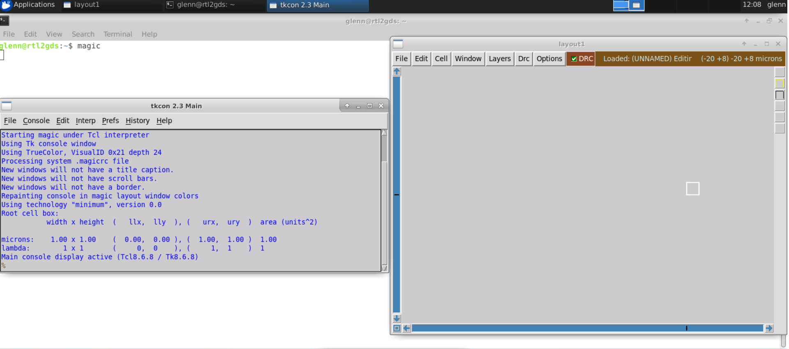
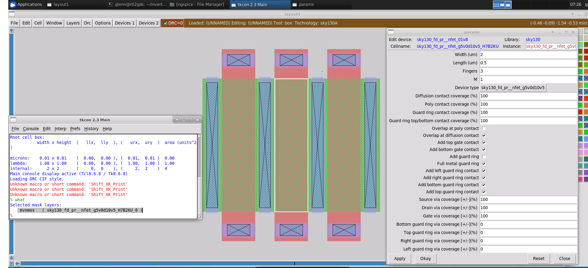
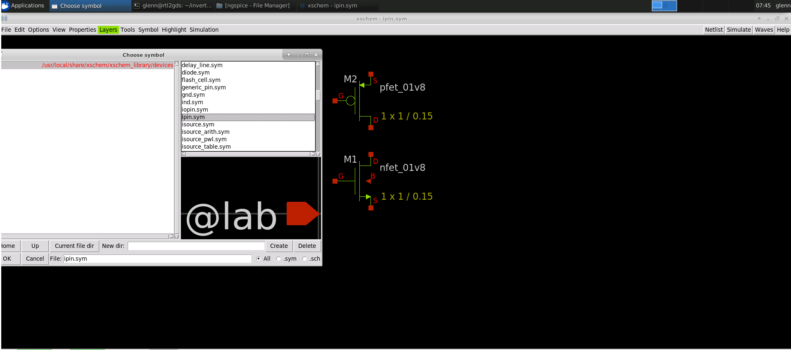
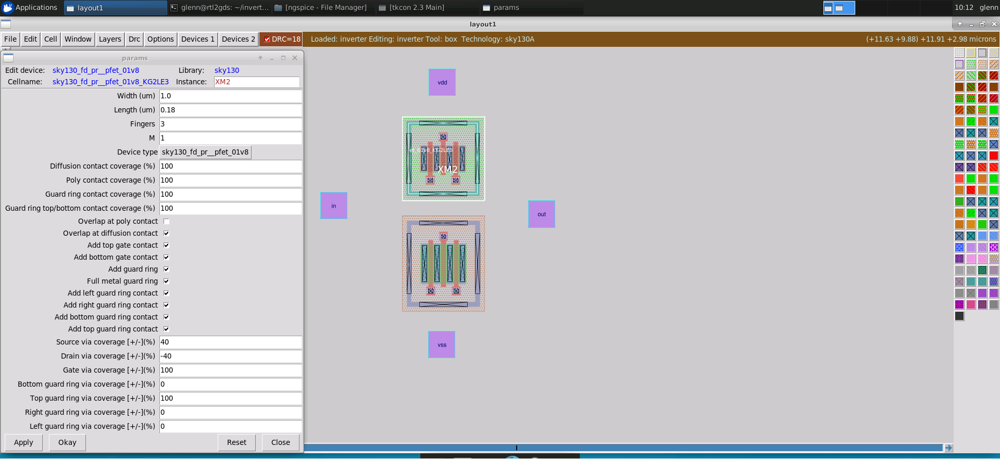
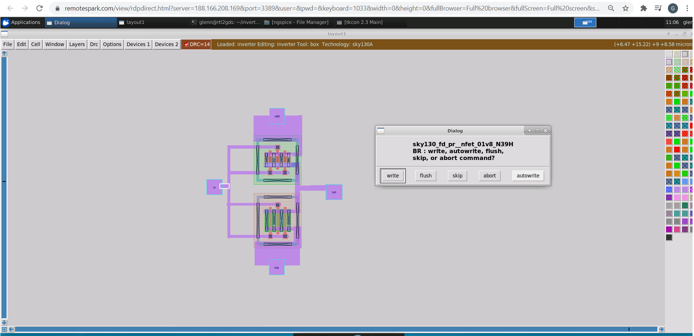
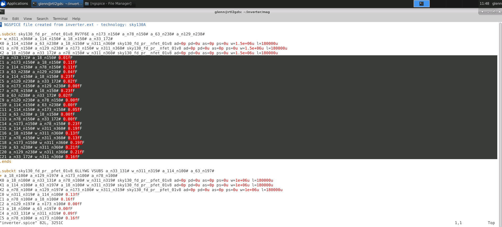

# Physical Verification using Sky130

### ABOUT THE WORKSHOP
The Workshop is a 5-day basic to advance program that is design for fresher who wants to build a career in VLSI industry. It is a cloud based workshop that comprises of training courses that covers RTL to GDS topics, labs, intelligent assessment program, and documentation to be presented in github which may serve as a resume.
### AUTHOR OF THE WORKSHOP
#### Mr. Kunal Ghosh
Co-founder of VLSI System Design (VSD) Corporation Private Limited
### AGENDA
  - ##### Day 1 - Introduction to SkyWater SKY130
    - Introduction to SkyWater PDKs and opensource EDA tools
      - Introduction to Skywater PDK
      - Opensource EDA Tools
      - Understanding Skywater PDK - Layers
      - Understanding Skywater PDK - Devices
      - Understanding Skywater PDK Libraries
      - Opensource Tools And Flows
    - Tool installations and basic DRC/LVS design flow
      - Check Tool Installations
      - Creating Sky130 Device Layout In Magic
      - Creating Simple Schematic In Xschem
      - Creating Symbol And Exporting Schematic In Xschem
      - Importing Schematic To Layout And Inverter Layout Steps
      - Final DRC/LVS Checks And Post Layout Simulations
### Day 1

