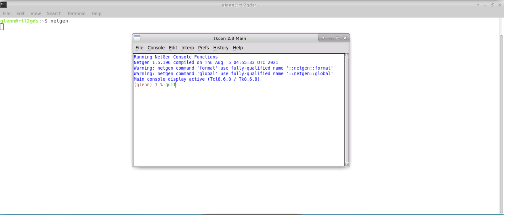
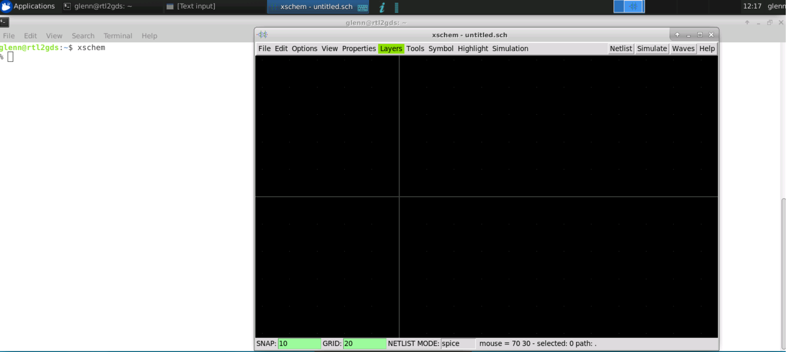
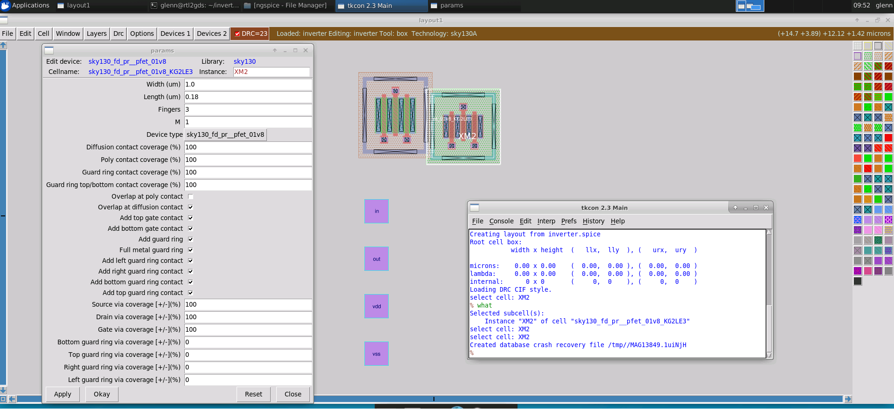
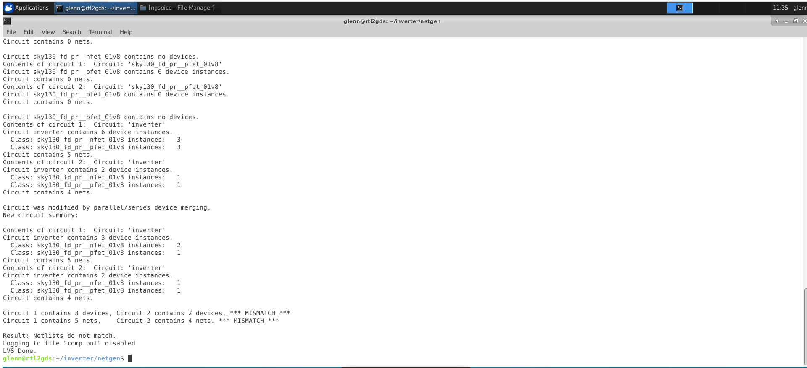

# Physical Verification using Sky130

### ABOUT THE WORKSHOP
The Workshop is a 5-day basic to advance program that is design for fresher who wants to build a career in VLSI industry. It is a cloud based workshop that comprises of training courses that covers RTL to GDS topics, labs, intelligent assessment program, and documentation to be presented in github which may serve as a resume.
### AUTHOR OF THE WORKSHOP
#### Mr. Kunal Ghosh
Co-founder of VLSI System Design (VSD) Corporation Private Limited
### AGENDA
  - ##### Day 1 - Introduction to SkyWater SKY130
    - Introduction to SkyWater PDKs and opensource EDA tools
      - Introduction to Skywater PDK
      - Opensource EDA Tools
      - Understanding Skywater PDK - Layers
      - Understanding Skywater PDK - Devices
      - Understanding Skywater PDK Libraries
      - Opensource Tools And Flows
    - Tool installations and basic DRC/LVS design flow
      - Check Tool Installations
      - Creating Sky130 Device Layout In Magic
      - Creating Simple Schematic In Xschem
      - Creating Symbol And Exporting Schematic In Xschem
      - Importing Schematic To Layout And Inverter Layout Steps
      - Final DRC/LVS Checks And Post Layout Simulations
### Day 1

- other commands on magic
* magic -noconsole - for no console command
* magic -dnull -noconsole  = no gui
* magic -dnull -noconsole test.tcl = run .tcl

* ngspice -b

- other commands on netgen
* netgen -noconsole - for no console command
* netgen -batch source test.tcl

- in magic go to devices 1 tab click pnp change width parameters to 2um, lenth 0.5, fingers 3

- no guard, change device type

- for nfet
- note that in xschem w is fingers times width of 
- device in this case 3 times 1.5 therefore 4.5
- change l to .18
- nf to 3
- for pfet

- note that in xschem w is fingers times width of 
- device in this case 3 times 1 therefore 3
- change l to .18
- nf to 3

-  after completing the schematic we need to implement a testbench that is separate to the schematic itself
-  the schematic  circuit will appear as a symbol in test bench schematic
-  go to symbol and click on make symbol from schematic then click ok to create a symbol for inverter circuit
-  create a new schematic for the testbench 
-  to insert the inverter symbol press insert in the keyboard go to the current directory select inverter.sym then press ok-

- save the schematic by going to file menu then click save as change the name to inverter.sch
- bydefault the local is chosen so click ok
- xschem press insert key in the keyboard
- 1 xschem library default library contains non pdk specific item like input output pins, power supply and test benchcomponents
- 2
- 3 sky water pdk

- hover into the symbol and press m to move the symbol
- press c to copy
- press w to wireup the components
- select the symbol then press q to change the name

- the test bench is pretty straight forward set a powersupply then ramp the input then watch the output response

- vsource.sym for powersupply in default library
- gnd.sym for ground
- create pins for the signal that you want to see in ngspice which is going to be the in and out
- we will use opin.sym for this

- now to make a proper spice testbench it needs to have something telling it how to do the spice analysis.

- the first thing to do is to set the voltage sources
- change the power supply value to 1.8 since this uses love voltage transistors which is capable of 1.8v
- for the input set the voltage sweep to a value use a piecewise linear function write as shown.
- "PWL(0 0 20n 0 900n 1.8)"

- now will need 2 more statement in the ouput spice netlist. because these wont be related to any components they need to be put into textblock to appear in the output. go to the libraries and select code_shown.sym
- the first one will tell ngspice where to find the device model for the devices that are use in the schematic. we'll use a .lib statement that select the toplevel file telling ngspice where to find all the models but also specifying the simulation corner for the models. we'll use the typical corner so the statement will be
- plot V(in) V(out) endc"which will run a transient simulation for 1 microsecond and plot the values for signal in and out. you can put new line for the block statement as long as the whole thing is surrounded by quotes then do a save as inverter_tb.sch
- to simulate all you need to do is to click on netlist, to get the netlist and then click simulate to run simulate
- the simulation will take awhile to startup because ngspice wants to read in all of the skywater model not just the one we are simulating . once its done it will plot the input vs output.will take a while to the line should cross at 0.8v
- after verifying the simulation close the ngspice but dont exit xschem just yet

- now the circuit has been funtionally validated through simulation we need to create a layout will need a netlist that is not the complete testbench but just the circuit it self. to do this go back to editing the inverter schematic which you can do through the menu file click open go to working directory then select inverter.sch then click ok

- open magic again go to the file menu and import spice from the pop up window move to the xschem directory where the netlist was save then select inverter.spicethe schematic import does not know how to do the analog place and route because that is very hard to implement but what magic can do is find all the device in the netlist and create them with the same parameters and drop them on a layout. It is up to you now to put them in the best position and wire them up. move the cursor to the npin then press i in the keyboard to select the instance then move the cursor above the nfet then press m to move pfet.

- There are some parameter that will make it much more convenient to wire this thing up. These parameter don't show up in schematic entry so you can only adjust them as needed in the layout. on the pfet device select top guard ring via coverage and type 100. this will make a local interconnect to metal 1 via at the top of the guard ring for source via coverage plus 40 for drain via coverage use -40 this will split the drain contact and move 1 to the top and the other to the bottom making it easy to connect them with the horizontal metal 1 wire do the same for the nfet device for source via coverage plus 40 for drain via coverage use -40 except for bottom guard ring via coverage set to 100

there is one detail that's need to be taken care of which is to go to the simulation menu and click on LVS netlist top level is a circuit. This will ensure that we properly define the subcircuit for creating a layout cell with pins on the layout press the simulation menu again and check to make sure it is selected by verifying there is a check mark before LVS netlist. once it's done click on netlist again. Then you may exit from xschem.

- after save and overwrite do not save and exit yet on the tkcon window type
- extract do local - make sure file is written in the local directory
- extract all = does the extraction
- the output is in the ext format but we want spice  format
- ext2spice lvs which sets up the netlist generator for hirarchical spice output in ngspice format with no parasitic component which is good for simulation but not for running lvs
- ext2spice which create the spice netlist

- netgen -batch lvs "..mag/inverter.spice inverter" "../xschem/inverter.spice inverter"
always use the layout netlist first then the schematic second so that you always know that on the side by side result the lest is the layout and the right is the schematic. each netlist is represented by a pair of keyword in quotes where the first is the location of the netlist file and the second is the name of the subcircuit to compare.

- this adds parasitic capacitance in the spice file
to view type vi inverter.spice
